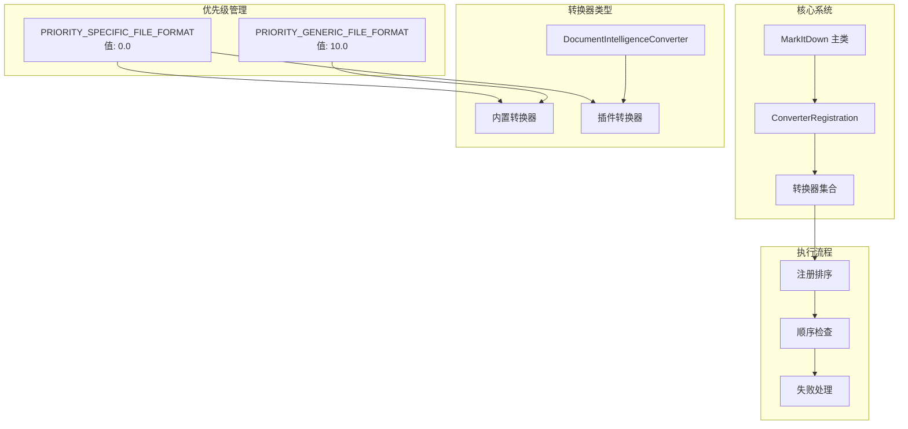
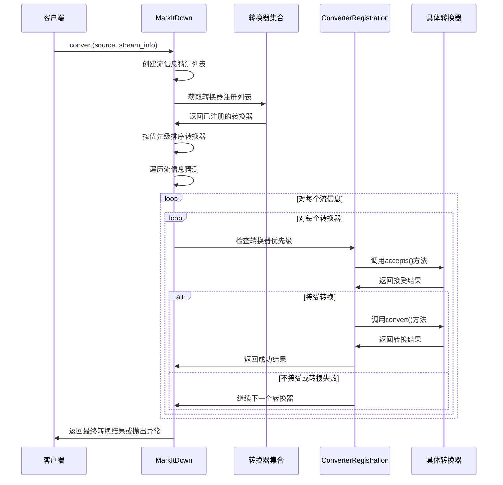
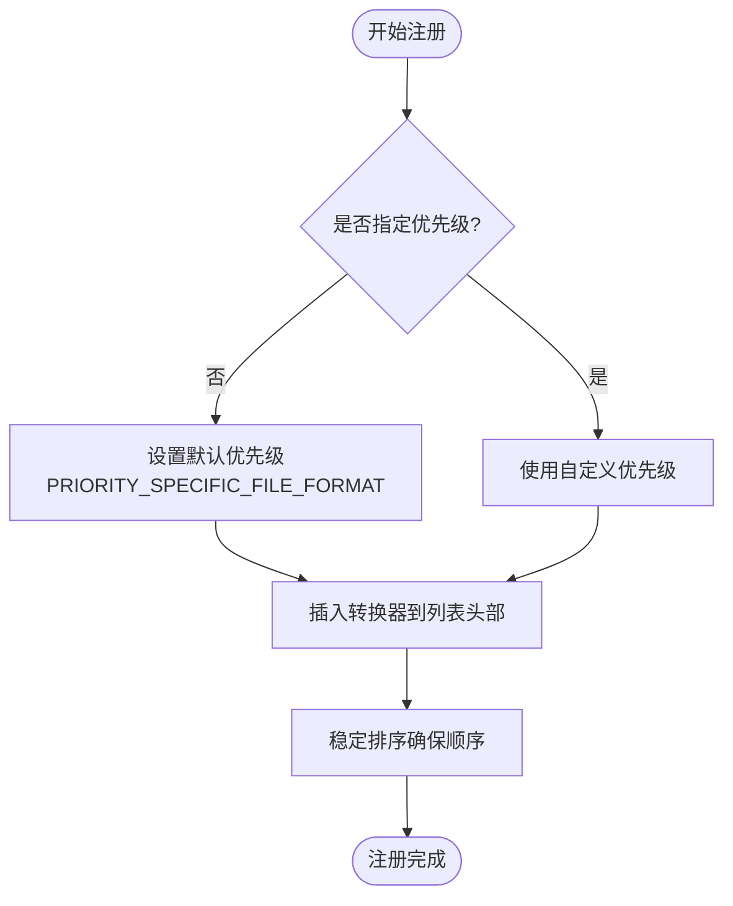
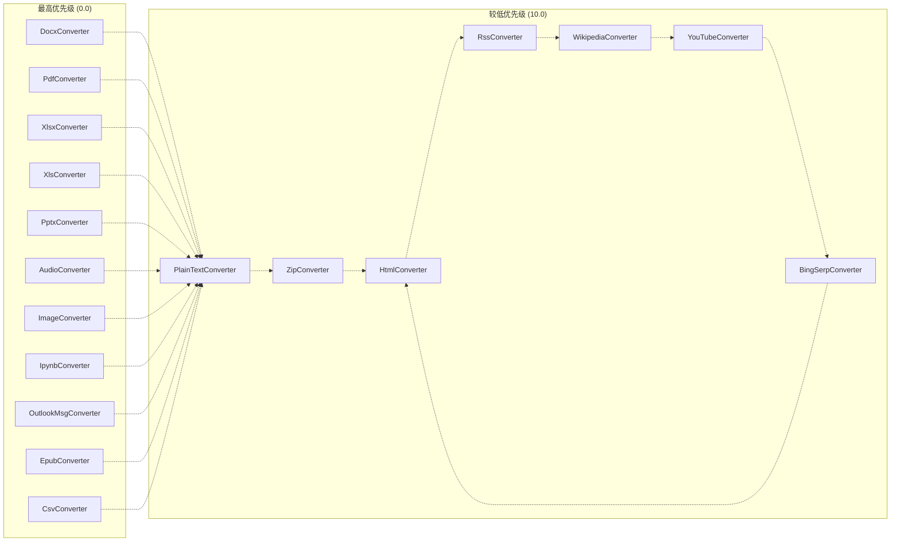
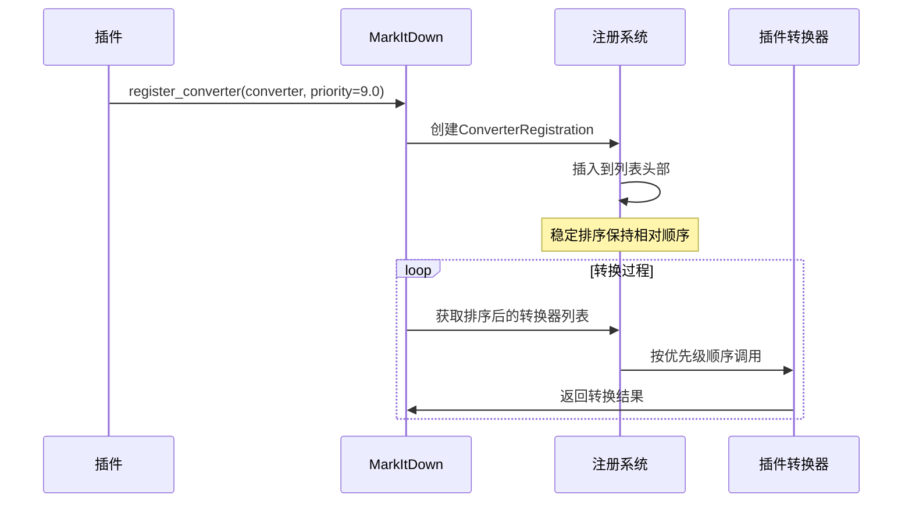
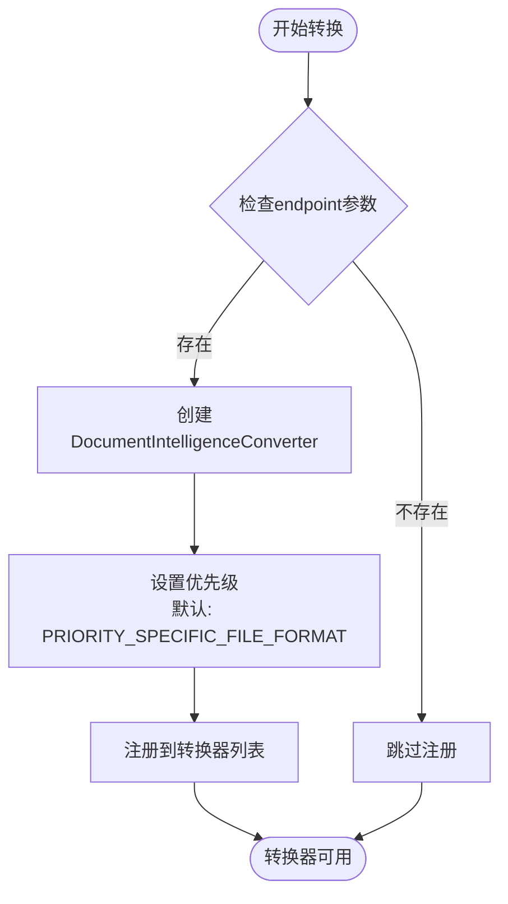
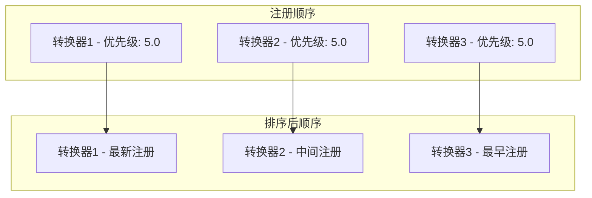

# 转换器优先级系统

<cite>
**本文档中引用的文件**
- [_markitdown.py](file://packages/markitdown/src/markitdown/_markitdown.py)
- [_base_converter.py](file://packages/markitdown/src/markitdown/_base_converter.py)
- [_doc_intel_converter.py](file://packages/markitdown/src/markitdown/converters/_doc_intel_converter.py)
- [_pdf_converter.py](file://packages/markitdown/src/markitdown/converters/_pdf_converter.py)
- [_docx_converter.py](file://packages/markitdown/src/markitdown/converters/_docx_converter.py)
- [_html_converter.py](file://packages/markitdown/src/markitdown/converters/_html_converter.py)
- [_plugin.py](file://packages/markitdown-sample-plugin/src/markitdown_sample_plugin/_plugin.py)
- [__init__.py](file://packages/markitdown/src/markitdown/__init__.py)
</cite>

## 目录
1. [简介](#简介)
2. [系统架构概览](#系统架构概览)
3. [优先级常量定义](#优先级常量定义)
4. [责任链模式实现](#责任链模式实现)
5. [转换器注册机制](#转换器注册机制)
6. [默认优先级设置](#默认优先级设置)
7. [插件系统与优先级控制](#插件系统与优先级控制)
8. [DocumentIntelligenceConverter优先级示例](#documentintelligenceconverter优先级示例)
9. [稳定排序与执行顺序](#稳定排序与执行顺序)
10. [配置建议与最佳实践](#配置建议与最佳实践)
11. [常见问题解决方案](#常见问题解决方案)
12. [总结](#总结)

## 简介

MarkItDown的转换器优先级系统是一个基于责任链模式的智能文件转换框架。该系统通过精心设计的优先级机制，确保最合适的转换器在转换过程中被优先选择和执行。系统采用数值越低优先级越高的设计原则，结合稳定排序算法，为用户提供灵活且可预测的转换体验。

## 系统架构概览

转换器优先级系统的核心架构围绕以下几个关键组件构建：

**图表来源**
- [_markitdown.py](file://packages/markitdown/src/markitdown/_markitdown.py#L61-L104)
- [_markitdown.py](file://packages/markitdown/src/markitdown/_markitdown.py#L653-L682)

## 优先级常量定义

系统定义了两个核心优先级常量，用于区分不同类型的转换器：

### PRIORITY_SPECIFIC_FILE_FORMAT（特定文件格式）
- **数值**: 0.0
- **用途**: 针对特定文件格式的专用转换器
- **典型转换器**: PDF、DOCX、XLSX等专业格式转换器
- **特点**: 最高优先级，优先于通用转换器执行

### PRIORITY_GENERIC_FILE_FORMAT（通用文件格式）
- **数值**: 10.0
- **用途**: 面向通用MIME类型和扩展名的转换器
- **典型转换器**: 文本文件、HTML、压缩包等基础格式转换器
- **特点**: 较低优先级，作为备选方案

**章节来源**
- [_markitdown.py](file://packages/markitdown/src/markitdown/_markitdown.py#L48-L55)

## 责任链模式实现

系统采用责任链模式，通过`_convert`方法实现转换器的有序遍历：

**图表来源**
- [_markitdown.py](file://packages/markitdown/src/markitdown/_markitdown.py#L535-L561)
- [_markitdown.py](file://packages/markitdown/src/markitdown/_markitdown.py#L653-L682)

**章节来源**
- [_markitdown.py](file://packages/markitdown/src/markitdown/_markitdown.py#L535-L620)

## 转换器注册机制

### register_converter方法详解

`register_converter`方法是转换器注册的核心入口，支持自定义优先级设置：

**图表来源**
- [_markitdown.py](file://packages/markitdown/src/markitdown/_markitdown.py#L630-L651)

### ConverterRegistration数据结构

每个转换器注册都封装在`ConverterRegistration`数据类中：

| 字段 | 类型 | 描述 |
|------|------|------|
| converter | DocumentConverter | 实际的转换器实例 |
| priority | float | 优先级数值，数值越小优先级越高 |

**章节来源**
- [_markitdown.py](file://packages/markitdown/src/markitdown/_markitdown.py#L630-L682)
- [_markitdown.py](file://packages/markitdown/src/markitdown/_markitdown.py#L61-L65)

## 默认优先级设置

### 内置转换器注册顺序

系统按照特定的优先级顺序注册内置转换器，体现了从专用到通用的设计理念：

**图表来源**
- [_markitdown.py](file://packages/markitdown/src/markitdown/_markitdown.py#L170-L196)

### 特殊情况处理

某些转换器被赋予特殊的优先级处理：
- **PlainTextConverter、HtmlConverter、ZipConverter**: 使用`PRIORITY_GENERIC_FILE_FORMAT`（10.0）
- **其他转换器**: 使用`PRIORITY_SPECIFIC_FILE_FORMAT`（0.0）

**章节来源**
- [_markitdown.py](file://packages/markitdown/src/markitdown/_markitdown.py#L170-L196)

## 插件系统与优先级控制

### 插件注册机制

插件系统允许第三方开发者通过设置优先级参数精确控制转换器的执行顺序：

**图表来源**
- [_markitdown.py](file://packages/markitdown/src/markitdown/_markitdown.py#L220-L256)
- [_plugin.py](file://packages/markitdown-sample-plugin/src/markitdown_sample_plugin/_plugin.py#L25-L30)

### 插件优先级策略

插件开发者可以通过以下策略控制转换器优先级：

| 优先级范围 | 应用场景 | 示例 |
|------------|----------|------|
| 0.0 - 9.0 | 在内置转换器之前执行 | 高级格式转换器 |
| 10.0 - 19.0 | 在通用转换器之后执行 | 特殊用途转换器 |
| 20.0+ | 作为最后备选方案 | 通用格式转换器 |

**章节来源**
- [_markitdown.py](file://packages/markitdown/src/markitdown/_markitdown.py#L653-L682)

## DocumentIntelligenceConverter优先级示例

### 高级功能的优先级体现

DocumentIntelligenceConverter作为高级功能转换器，其优先级设置体现了系统对复杂文档处理的重视：

**图表来源**
- [_markitdown.py](file://packages/markitdown/src/markitdown/_markitdown.py#L198-L222)

### 配置参数影响

DocumentIntelligenceConverter的注册受到多个配置参数的影响：

| 参数 | 类型 | 描述 | 默认行为 |
|------|------|------|----------|
| docintel_endpoint | str | Azure Document Intelligence服务端点 | 可选，不提供时不注册 |
| docintel_credential | Credential | 认证凭据 | 支持AzureKeyCredential或DefaultAzureCredential |
| docintel_file_types | List | 支持的文件类型 | 默认包含所有支持的格式 |
| docintel_api_version | str | API版本 | 默认"2024-07-31-preview" |

**章节来源**
- [_markitdown.py](file://packages/markitdown/src/markitdown/_markitdown.py#L198-L222)
- [_doc_intel_converter.py](file://packages/markitdown/src/markitdown/converters/_doc_intel_converter.py#L132-L160)

## 稳定排序与执行顺序

### 排序算法特性

系统使用Python内置的`sorted()`函数进行稳定排序，确保相同优先级下的转换器按注册顺序执行：

**图表来源**
- [_markitdown.py](file://packages/markitdown/src/markitdown/_markitdown.py#L545-L550)

### 执行顺序规则

1. **优先级排序**: 数值越小优先级越高
2. **稳定排序**: 相同优先级保持注册顺序
3. **最新注册优先**: 同一优先级下，最后注册的转换器优先执行

**章节来源**
- [_markitdown.py](file://packages/markitdown/src/markitdown/_markitdown.py#L545-L550)

## 配置建议与最佳实践

### 优先级设置指南

#### 对于内置转换器
- **专用格式**: 使用`PRIORITY_SPECIFIC_FILE_FORMAT`（0.0）
- **通用格式**: 使用`PRIORITY_GENERIC_FILE_FORMAT`（10.0）
- **特殊情况**: 根据需求调整优先级

#### 对于插件转换器
- **高性能转换器**: 设置较低优先级（1.0-9.0）
- **通用转换器**: 设置较高优先级（11.0-19.0）
- **备选转换器**: 设置最高优先级（20.0+）

### 性能优化建议

1. **优先级分层**: 建立清晰的优先级层次结构
2. **快速拒绝**: 在`accepts()`方法中尽早返回False
3. **资源管理**: 合理管理转换器的生命周期

## 常见问题解决方案

### 问题1：转换器未按预期执行

**症状**: 自定义转换器没有被调用

**原因**: 优先级设置不当或`accepts()`方法返回False

**解决方案**:
1. 检查优先级设置是否正确
2. 验证`accepts()`方法的逻辑
3. 确认文件类型匹配

### 问题2：转换质量不佳

**症状**: 转换结果不符合预期

**原因**: 优先级过高导致更合适的转换器被跳过

**解决方案**:
1. 调整转换器优先级
2. 优化`accepts()`方法的判断逻辑
3. 添加更多的文件类型检测

### 问题3：性能问题

**症状**: 转换过程耗时过长

**原因**: 多个转换器尝试处理同一文件

**解决方案**:
1. 优化`accepts()`方法的性能
2. 设置合理的优先级避免重复尝试
3. 使用早期退出机制

## 总结

MarkItDown的转换器优先级系统通过责任链模式和稳定排序算法，实现了灵活而高效的文件转换框架。系统的核心优势包括：

1. **明确的优先级层次**: 清晰的数值越低优先级越高的设计原则
2. **稳定的执行顺序**: 保证相同优先级下最新的转换器优先执行
3. **灵活的插件支持**: 允许第三方开发者精确控制转换器优先级
4. **智能的默认配置**: 内置转换器按照从专用到通用的顺序注册

通过合理使用优先级系统，开发者可以构建出既高效又可靠的文档转换解决方案，满足各种复杂的转换需求。