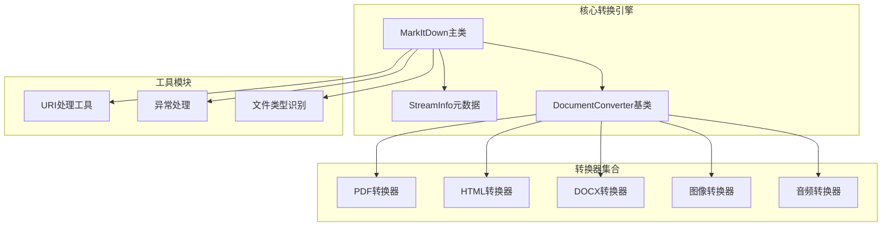
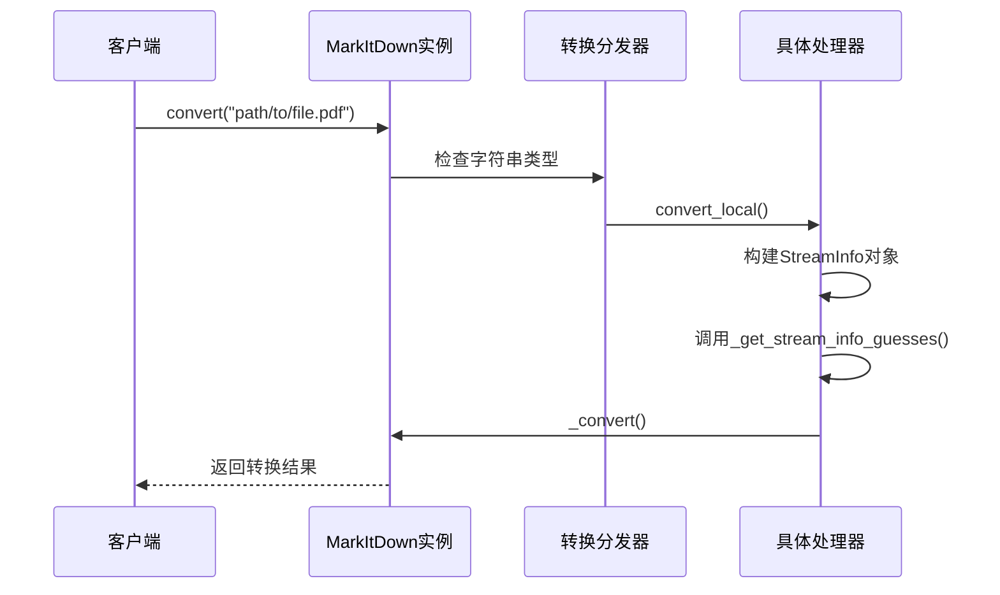
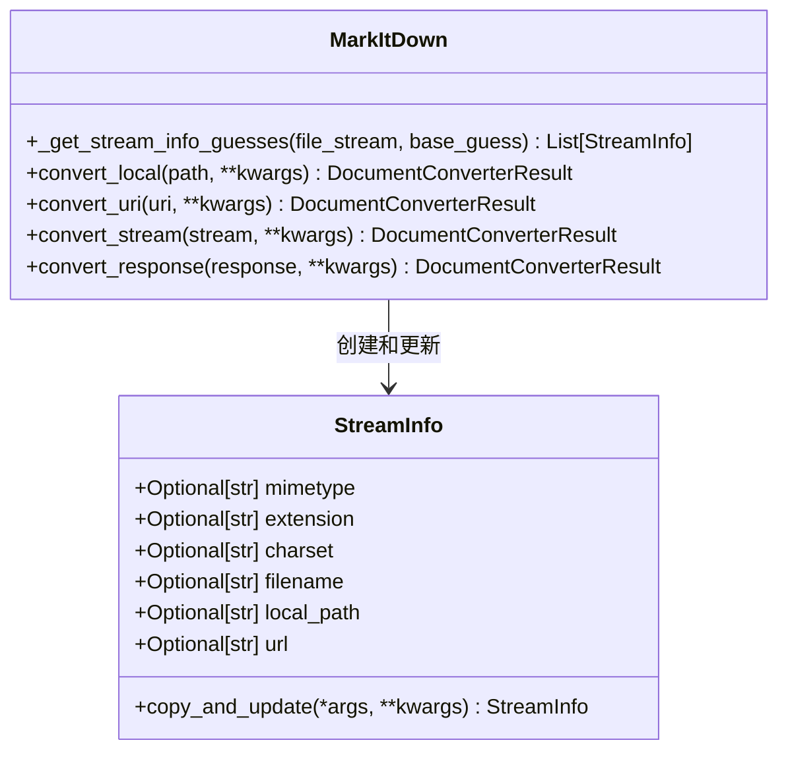
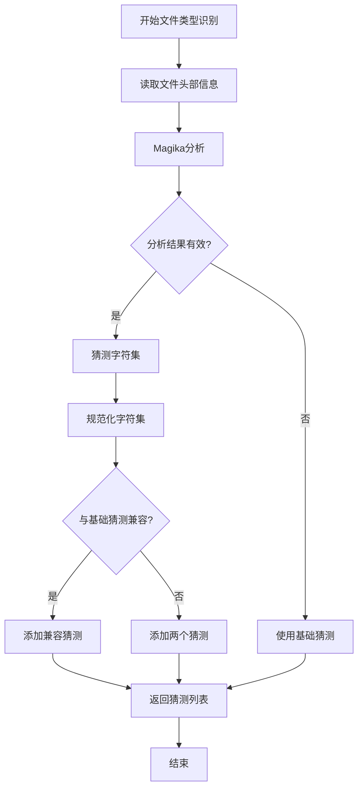
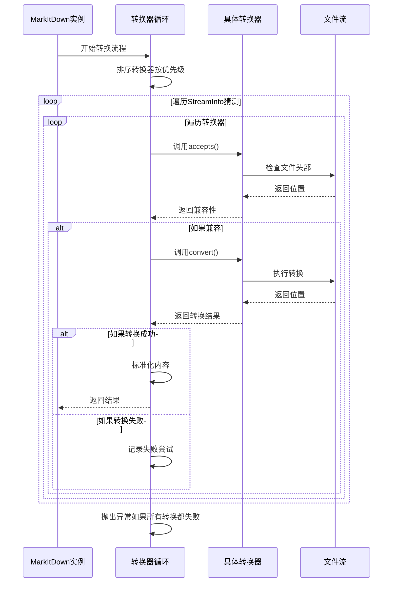
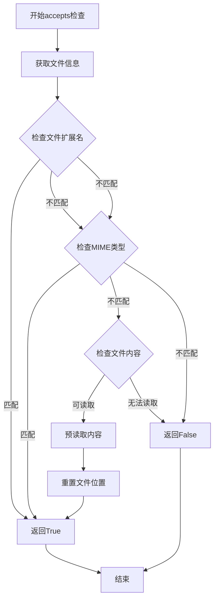
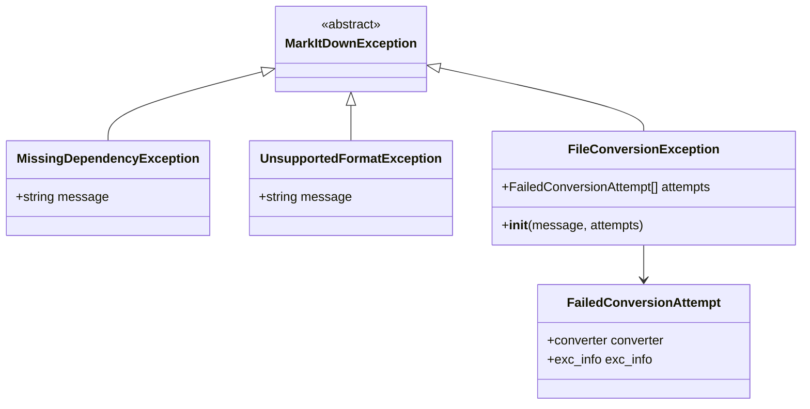

# 转换流程

<cite>
**本文档中引用的文件**
- [_markitdown.py](file://packages/markitdown/src/markitdown/_markitdown.py)
- [_stream_info.py](file://packages/markitdown/src/markitdown/_stream_info.py)
- [_base_converter.py](file://packages/markitdown/src/markitdown/_base_converter.py)
- [_uri_utils.py](file://packages/markitdown/src/markitdown/_uri_utils.py)
- [_pdf_converter.py](file://packages/markitdown/src/markitdown/converters/_pdf_converter.py)
- [_html_converter.py](file://packages/markitdown/src/markitdown/converters/_html_converter.py)
- [_exceptions.py](file://packages/markitdown/src/markitdown/_exceptions.py)
</cite>

## 目录
1. [简介](#简介)
2. [项目结构概览](#项目结构概览)
3. [核心组件](#核心组件)
4. [架构概览](#架构概览)
5. [详细组件分析](#详细组件分析)
6. [转换流程详解](#转换流程详解)
7. [异常处理机制](#异常处理机制)
8. [性能考虑](#性能考虑)
9. [故障排除指南](#故障排除指南)
10. [结论](#结论)

## 简介

MarkItDown是一个强大的Python包，专门用于将各种文件格式转换为Markdown格式。该系统采用模块化设计，支持多种输入源（文件路径、URL、数据URI、二进制流），并通过智能的转换器选择机制实现高效的文档转换。

## 项目结构概览

MarkItDown项目采用清晰的分层架构，主要包含以下核心模块：



**图表来源**
- [_markitdown.py](file://packages/markitdown/src/markitdown/_markitdown.py#L1-L50)
- [_stream_info.py](file://packages/markitdown/src/markitdown/_stream_info.py#L1-L33)
- [_base_converter.py](file://packages/markitdown/src/markitdown/_base_converter.py#L1-L106)

**章节来源**
- [_markitdown.py](file://packages/markitdown/src/markitdown/_markitdown.py#L1-L100)
- [_stream_info.py](file://packages/markitdown/src/markitdown/_stream_info.py#L1-L33)

## 核心组件

### MarkItDown主类

MarkItDown类是整个转换系统的核心控制器，负责协调所有转换操作。它提供了统一的API接口，支持多种输入源的处理。

### StreamInfo元数据类

StreamInfo类封装了文件流的所有相关信息，包括MIME类型、文件扩展名、字符集、文件名、本地路径和URL等元数据。

### DocumentConverter抽象基类

DocumentConverter定义了所有转换器必须实现的标准接口，包括accepts()和convert()方法。

**章节来源**
- [_markitdown.py](file://packages/markitdown/src/markitdown/_markitdown.py#L100-L200)
- [_stream_info.py](file://packages/markitdown/src/markitdown/_stream_info.py#L5-L33)
- [_base_converter.py](file://packages/markitdown/src/markitdown/_base_converter.py#L40-L106)

## 架构概览

MarkItDown采用分层架构设计，确保了良好的可扩展性和维护性：

```mermaid
graph TD
Input[输入源] --> Dispatcher[转换分发器]
Dispatcher --> LocalHandler[本地文件处理器]
Dispatcher --> URIHandler[URI处理器]
Dispatcher --> StreamHandler[流处理器]
Dispatcher --> ResponseHandler[响应处理器]
LocalHandler --> StreamInfoBuilder[StreamInfo构建器]
URIHandler --> StreamInfoBuilder
StreamHandler --> StreamInfoBuilder
ResponseHandler --> StreamInfoBuilder
StreamInfoBuilder --> MagikaAnalyzer[Magika分析器]
MagikaAnalyzer --> TypeGuesser[类型猜测器]
TypeGuesser --> ConverterSelector[转换器选择器]
ConverterSelector --> PrioritySorter[优先级排序器]
PrioritySorter --> ConverterLoop[转换器循环]
ConverterLoop --> AcceptsCheck{accepts()检查}
AcceptsCheck --> |兼容| ConvertMethod[convert()方法]
AcceptsCheck --> |不兼容| NextConverter[下一个转换器]
ConvertMethod --> ResultNormalizer[结果标准化器]
ResultNormalizer --> Output[Markdown输出]
ConvertMethod --> ExceptionHandler[异常处理器]
ExceptionHandler --> FailedAttempts[失败尝试记录]
```

**图表来源**
- [_markitdown.py](file://packages/markitdown/src/markitdown/_markitdown.py#L250-L350)
- [_markitdown.py](file://packages/markitdown/src/markitdown/_markitdown.py#L600-L700)

## 详细组件分析

### 输入源处理机制

MarkItDown支持四种主要的输入源类型，每种都有专门的处理逻辑：

#### 1. 字符串输入（文件路径或URL）


**图表来源**
- [_markitdown.py](file://packages/markitdown/src/markitdown/_markitdown.py#L250-L280)

#### 2. Path对象输入
当传入Path对象时，系统会自动调用convert_local方法进行处理。

#### 3. BinaryIO流输入
对于二进制流输入，系统会检查流是否可寻址，不可寻址的流会被读取到内存中。

#### 4. requests.Response对象
HTTP响应对象会被特殊处理，提取内容类型、字符集和文件名信息。

**章节来源**
- [_markitdown.py](file://packages/markitdown/src/markitdown/_markitdown.py#L250-L350)

### StreamInfo元数据构建

StreamInfo是转换过程中的关键数据结构，它封装了文件的所有相关信息：



**图表来源**
- [_stream_info.py](file://packages/markitdown/src/markitdown/_stream_info.py#L5-L33)
- [_markitdown.py](file://packages/markitdown/src/markitdown/_markitdown.py#L650-L750)

**章节来源**
- [_stream_info.py](file://packages/markitdown/src/markitdown/_stream_info.py#L1-L33)
- [_markitdown.py](file://packages/markitdown/src/markitdown/_markitdown.py#L650-L750)

### Magika文件类型智能识别

系统使用Magika库进行智能的文件类型识别，这是转换流程中的关键步骤：



**图表来源**
- [_markitdown.py](file://packages/markitdown/src/markitdown/_markitdown.py#L650-L750)

**章节来源**
- [_markitdown.py](file://packages/markitdown/src/markitdown/_markitdown.py#L650-L750)

## 转换流程详解

### 核心转换方法(_convert)

_convert方法是整个转换流程的核心，它实现了智能的转换器选择和执行机制：



**图表来源**
- [_markitdown.py](file://packages/markitdown/src/markitdown/_markitdown.py#L550-L650)

### 转换器优先级系统

MarkItDown使用优先级系统来决定转换器的执行顺序：

| 优先级值 | 转换器类型 | 描述 |
|---------|-----------|------|
| 0.0 | 特定文件格式 | 如.docx、.pdf、.xlsx等特定格式 |
| 10.0 | 通用文件格式 | 如text/*等通用MIME类型 |

这种设计确保了最专业的转换器优先被尝试，提高了转换成功率。

**章节来源**
- [_markitdown.py](file://packages/markitdown/src/markitdown/_markitdown.py#L550-L650)

### 转换器兼容性检查

每个转换器都实现了accepts()方法来检查是否能够处理给定的文件：



**图表来源**
- [_base_converter.py](file://packages/markitdown/src/markitdown/_base_converter.py#L40-L80)

**章节来源**
- [_base_converter.py](file://packages/markitdown/src/markitdown/_base_converter.py#L40-L80)

## 异常处理机制

MarkItDown实现了完善的异常处理机制，确保转换过程的健壮性：

### 异常层次结构



**图表来源**
- [_exceptions.py](file://packages/markitdown/src/markitdown/_exceptions.py#L10-L77)

### 失败尝试收集

系统会收集所有失败的转换尝试，为调试和错误报告提供详细信息：

- **FailedConversionAttempt**: 记录失败的转换器和异常信息
- **FileConversionException**: 包含所有失败尝试的汇总信息
- **MissingDependencyException**: 专门处理依赖缺失的情况

**章节来源**
- [_exceptions.py](file://packages/markitdown/src/markitdown/_exceptions.py#L1-L77)

## 性能考虑

### 流式处理优化

MarkItDown采用流式处理策略，避免将大文件完全加载到内存中：

- **可寻址流**: 直接处理，无需额外缓冲
- **不可寻址流**: 自动缓冲到内存，但保持流式读取
- **HTTP响应**: 分块读取，支持大文件下载

### 缓存和重用机制

- **Magika缓存**: 重复使用Magika实例进行文件类型识别
- **转换器注册**: 预先注册的转换器列表，避免运行时查找
- **StreamInfo复用**: 通过copy_and_update方法高效更新元数据

### 并行处理能力

虽然当前实现是单线程的，但架构设计支持未来的并行处理扩展。

## 故障排除指南

### 常见问题及解决方案

#### 1. 依赖缺失问题
**症状**: MissingDependencyException异常
**解决方案**: 安装相应的可选依赖
```bash
pip install markitdown[pdf]
pip install markitdown[all]
```

#### 2. 不支持的文件格式
**症状**: UnsupportedFormatException异常
**解决方案**: 
- 检查文件格式是否受支持
- 添加自定义转换器插件
- 使用通用转换器作为后备

#### 3. 转换失败
**症状**: FileConversionException异常
**解决方案**: 
- 检查失败尝试日志
- 验证文件完整性
- 尝试不同的转换器配置

**章节来源**
- [_exceptions.py](file://packages/markitdown/src/markitdown/_exceptions.py#L10-L50)

## 结论

MarkItDown提供了一个强大而灵活的文档转换框架，通过智能的输入源处理、精确的文件类型识别、可靠的转换器选择机制和完善的异常处理，实现了高质量的文档转换服务。

### 主要优势

1. **多源支持**: 统一处理文件路径、URL、数据URI和二进制流
2. **智能识别**: 基于Magika的文件类型智能识别
3. **模块化设计**: 易于扩展和定制的转换器架构
4. **健壮性**: 完善的异常处理和失败恢复机制
5. **性能优化**: 流式处理和缓存机制

### 未来发展方向

- 支持更多文件格式和转换器
- 实现并行处理以提高性能
- 增强AI辅助的转换质量
- 提供更丰富的插件生态系统

通过深入理解这些转换流程和机制，开发者可以更好地利用MarkItDown的强大功能，构建高质量的文档处理应用。