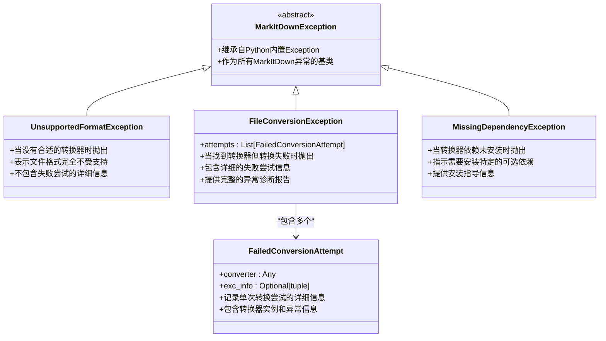
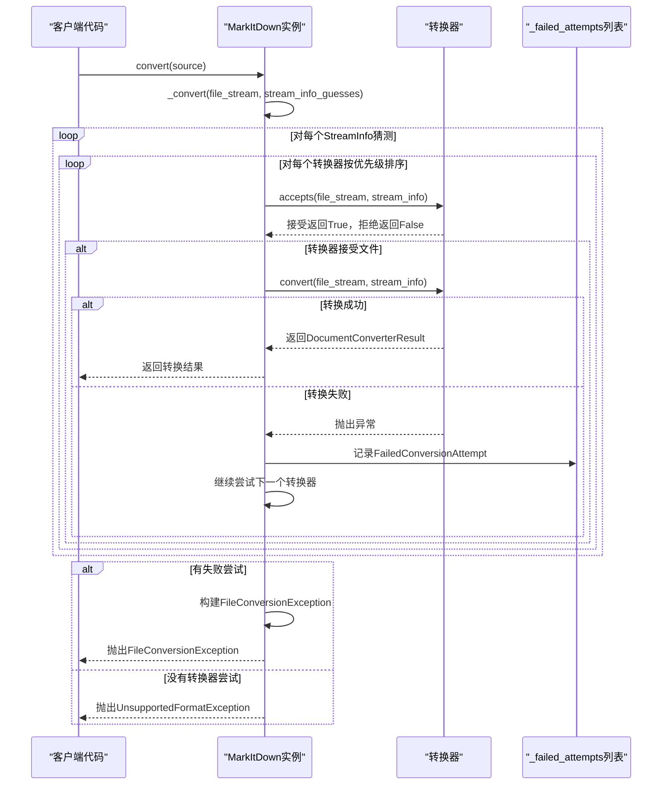
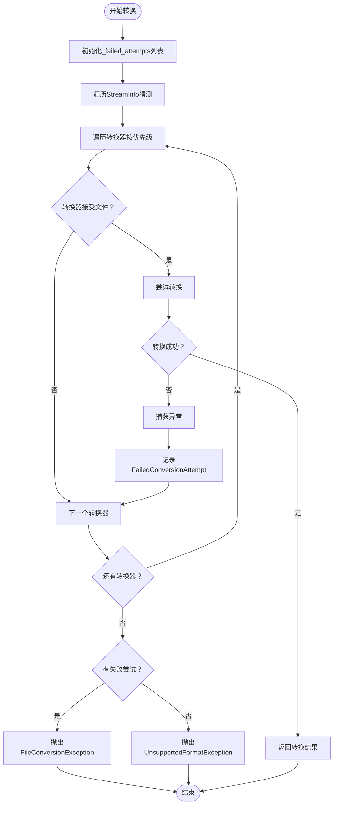
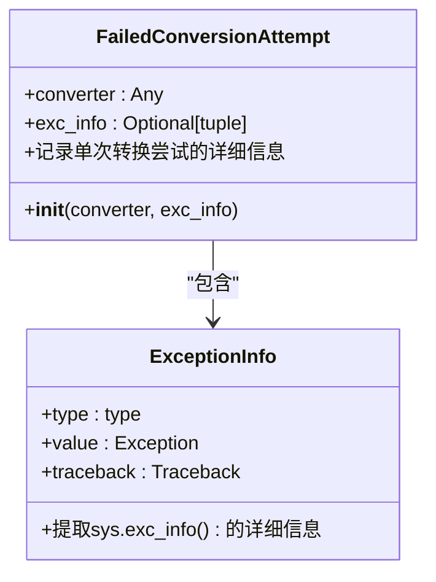

# 错误处理机制

<cite>
**本文档中引用的文件**
- [_exceptions.py](file://packages/markitdown/src/markitdown/_exceptions.py)
- [_markitdown.py](file://packages/markitdown/src/markitdown/_markitdown.py)
- [_base_converter.py](file://packages/markitdown/src/markitdown/_base_converter.py)
- [_ipynb_converter.py](file://packages/markitdown/src/markitdown/converters/_ipynb_converter.py)
- [_xlsx_converter.py](file://packages/markitdown/src/markitdown/converters/_xlsx_converter.py)
- [_docx_converter.py](file://packages/markitdown/src/markitdown/converters/_docx_converter.py)
- [test_module_misc.py](file://packages/markitdown/tests/test_module_misc.py)
</cite>

## 目录
1. [概述](#概述)
2. [核心异常类](#核心异常类)
3. [错误处理架构](#错误处理架构)
4. [_failed_attempts列表机制](#failed_attempts列表机制)
5. [异常触发条件](#异常触发条件)
6. [FailedConversionAttempt记录机制](#failedconversionattempt记录机制)
7. [最佳实践代码示例](#最佳实践代码示例)
8. [故障排除指南](#故障排除指南)
9. [总结](#总结)

## 概述

MarkItDown的错误处理机制是一个精心设计的多层次异常处理系统，专门用于处理文档转换过程中的各种异常情况。该系统通过区分不同类型的转换失败原因，为用户提供详细的错误诊断信息，帮助快速定位和解决问题。

系统的核心设计理念是：
- **精确分类**：区分转换器接受文件但转换失败（FileConversionException）和没有任何转换器能处理文件（UnsupportedFormatException）
- **详细追踪**：通过_failed_attempts列表记录每个失败的转换器及其异常信息
- **可诊断性**：提供完整的异常堆栈跟踪和转换器信息
- **用户体验**：为用户提供清晰的错误信息和解决方案建议

## 核心异常类

### 异常类层次结构



**图表来源**
- [_exceptions.py](file://packages/markitdown/src/markitdown/_exceptions.py#L10-L75)

### MarkItDownException基类

所有MarkItDown异常都继承自`MarkItDownException`，这是一个简单的抽象基类，为整个异常体系提供统一的基础。

**章节来源**
- [_exceptions.py](file://packages/markitdown/src/markitdown/_exceptions.py#L10-L15)

### UnsupportedFormatException

`UnsupportedFormatException`在没有任何转换器能够处理给定文件时抛出。这种异常表明文件格式完全不受MarkItDown支持，或者系统中没有任何可用的转换器来处理该格式。

**触发条件**：
- 所有注册的转换器都不接受该文件
- 文件格式完全未知或不受支持
- 系统中没有针对该格式的转换器

**特点**：
- 不包含失败尝试的详细信息
- 表示根本性的格式不支持问题
- 通常需要用户检查文件格式或等待未来版本支持

**章节来源**
- [_exceptions.py](file://packages/markitdown/src/markitdown/_exceptions.py#L28-L33)

### FileConversionException

`FileConversionException`在找到合适的转换器但转换过程失败时抛出。这是最常见的情况，包含了详细的失败尝试信息，为问题诊断提供了丰富的上下文。

**触发条件**：
- 至少有一个转换器接受文件
- 转换过程中发生异常
- 需要多个转换器尝试才能确定最终结果

**特点**：
- 包含`attempts`属性，记录所有失败的转换尝试
- 提供完整的异常堆栈跟踪信息
- 支持多层嵌套异常的诊断
- 可以包含多种不同类型的转换器失败

**章节来源**
- [_exceptions.py](file://packages/markitdown/src/markitdown/_exceptions.py#L47-L75)

## 错误处理架构

### 转换流程中的异常处理



**图表来源**
- [_markitdown.py](file://packages/markitdown/src/markitdown/_markitdown.py#L499-L625)

### 异常处理的关键机制

系统在`_convert`方法中实现了核心的异常处理逻辑：

1. **转换器遍历**：按优先级顺序尝试所有注册的转换器
2. **接受检查**：每个转换器先检查是否接受当前文件
3. **转换执行**：接受的转换器尝试实际转换
4. **异常捕获**：捕获转换过程中的任何异常
5. **失败记录**：将失败的转换器和异常信息记录到_failed_attempts列表
6. **继续尝试**：即使某个转换器失败，也继续尝试其他转换器
7. **最终决策**：根据是否有失败尝试决定抛出哪种异常

**章节来源**
- [_markitdown.py](file://packages/markitdown/src/markitdown/_markitdown.py#L499-L625)

## _failed_attempts列表机制

### 列表的作用和生命周期

`_failed_attempts`列表是FileConversionException的核心组成部分，它在`_convert`方法中被初始化和维护：



**图表来源**
- [_markitdown.py](file://packages/markitdown/src/markitdown/_markitdown.py#L520-L625)

### 列表的初始化和管理

_failed_attempts列表在每次调用`_convert`方法时都会被重新初始化，确保每次转换都有独立的失败记录：

**章节来源**
- [_markitdown.py](file://packages/markitdown/src/markitdown/_markitdown.py#L520-L522)

### 异常信息的收集时机

系统在以下情况下会将转换器的失败信息添加到_failed_attempts列表：

1. **转换器异常**：当转换器的`convert()`方法抛出异常时
2. **系统异常**：当转换过程中发生系统级异常时
3. **流位置重置**：无论成功还是失败，都会重置文件流位置

**章节来源**
- [_markitdown.py](file://packages/markitdown/src/markitdown/_markitdown.py#L590-L605)

## 异常触发条件

### FileConversionException的触发条件

FileConversionException在以下情况下被触发：

1. **转换器接受但转换失败**：至少有一个转换器接受文件，但在转换过程中抛出异常
2. **多转换器尝试**：系统尝试了多个转换器，但所有尝试都失败
3. **具体转换问题**：文件格式被识别，但转换过程中出现具体的技术问题

**触发示例**：
- PDF文件损坏导致转换失败
- DOCX文件包含无法解析的特殊格式
- Excel文件包含不支持的数据类型
- 图像文件格式不完整

### UnsupportedFormatException的触发条件

UnsupportedFormatException在以下情况下被触发：

1. **无转换器接受**：所有注册的转换器都不接受该文件
2. **未知格式**：文件扩展名或MIME类型完全未知
3. **系统限制**：当前安装的转换器集合无法处理该格式

**触发示例**：
- 纯二进制文件（如`.bin`）
- 非标准的文档格式
- 已废弃的文件格式
- 系统中未安装相关转换器的格式

**章节来源**
- [_markitdown.py](file://packages/markitdown/src/markitdown/_markitdown.py#L618-L623)

## FailedConversionAttempt记录机制

### FailedConversionAttempt类结构



**图表来源**
- [_exceptions.py](file://packages/markitdown/src/markitdown/_exceptions.py#L38-L45)

### 异常信息的捕获和存储

FailedConversionAttempt通过以下方式捕获和存储异常信息：

1. **sys.exc_info()调用**：在异常发生时立即调用`sys.exc_info()`获取完整异常信息
2. **三元组存储**：存储`(exception_type, exception_value, traceback)`三元组
3. **转换器引用**：保存失败转换器的实例引用
4. **可选信息**：如果异常信息不可用，则只存储转换器引用

**章节来源**
- [_exceptions.py](file://packages/markitdown/src/markitdown/_exceptions.py#L42-L45)

### 异常信息的格式化输出

FileConversionException在构造时会格式化显示所有失败尝试的信息：

**章节来源**
- [_exceptions.py](file://packages/markitdown/src/markitdown/_exceptions.py#L55-L70)

## 最佳实践代码示例

### 基本异常捕获模式

以下是处理MarkItDown异常的最佳实践代码模式：

```python
# 基本异常处理示例
from markitdown import MarkItDown
from markitdown._exceptions import FileConversionException, UnsupportedFormatException

def safe_convert_with_diagnostics(source_path: str) -> str:
    """
    安全地转换文件，并提供详细的诊断信息
    """
    markitdown = MarkItDown()
    
    try:
        result = markitdown.convert(source_path)
        return result.text_content
        
    except UnsupportedFormatException as e:
        # 处理不支持的文件格式
        print(f"文件格式不受支持: {source_path}")
        print(f"错误详情: {str(e)}")
        
        # 提供可能的解决方案
        print("\n可能的解决方案:")
        print("- 检查文件扩展名是否正确")
        print("- 确认文件格式是否在MarkItDown支持范围内")
        print("- 尝试将文件转换为支持的格式（如PDF、DOCX等）")
        
        return f"转换失败: 不支持的文件格式 - {source_path}"
        
    except FileConversionException as e:
        # 处理转换失败的情况
        print(f"文件转换失败: {source_path}")
        print(f"失败尝试次数: {len(e.attempts)}")
        
        for i, attempt in enumerate(e.attempts, 1):
            converter_name = type(attempt.converter).__name__
            
            if attempt.exc_info:
                exc_type, exc_value, _ = attempt.exc_info
                print(f"\n尝试 {i}: {converter_name} 失败")
                print(f"  异常类型: {exc_type.__name__}")
                print(f"  错误消息: {exc_value}")
            else:
                print(f"\n尝试 {i}: {converter_name} 失败（无异常信息）")
        
        return f"转换失败: {len(e.attempts)}个转换器尝试均失败"
```

### 高级诊断和恢复策略

```python
# 高级诊断和恢复策略示例
def advanced_conversion_with_recovery(source_path: str) -> str:
    """
    带有恢复策略的高级转换功能
    """
    markitdown = MarkItDown()
    
    try:
        # 第一次尝试直接转换
        return markitdown.convert(source_path).text_content
        
    except FileConversionException as e:
        # 分析失败原因并尝试恢复
        problematic_converters = []
        for attempt in e.attempts:
            converter_name = type(attempt.converter).__name__
            problematic_converters.append(converter_name)
            
            # 特定转换器的恢复策略
            if converter_name == "PdfConverter" and "encrypted" in str(attempt.exc_info[1]).lower():
                # 尝试解密PDF
                return recover_encrypted_pdf(source_path)
            elif converter_name == "DocxConverter" and "corrupted" in str(attempt.exc_info[1]).lower():
                # 尝试修复损坏的DOCX
                return repair_corrupted_docx(source_path)
        
        # 如果无法自动恢复，提供详细诊断
        raise Exception(f"无法自动恢复: {problematic_converters}")
        
    except UnsupportedFormatException:
        # 尝试文件格式检测和转换
        detected_format = detect_file_format(source_path)
        if detected_format:
            # 尝试格式转换
            temp_path = convert_to_supported_format(source_path, detected_format)
            return markitdown.convert(temp_path).text_content
        else:
            raise
```

### 转换器特定的异常处理

```python
# 转换器特定的异常处理示例
def handle_specific_converter_exceptions(source_path: str) -> str:
    """
    针对特定转换器的异常处理
    """
    markitdown = MarkItDown()
    
    try:
        return markitdown.convert(source_path).text_content
        
    except FileConversionException as e:
        # 分析特定转换器的失败
        for attempt in e.attempts:
            converter_type = type(attempt.converter)
            
            if converter_type == markitdown.converters.PdfConverter:
                # PDF转换器特有的处理
                if "password" in str(attempt.exc_info[1]).lower():
                    print("PDF文件受密码保护")
                    return handle_password_protected_pdf(source_path)
                elif "corrupted" in str(attempt.exc_info[1]).lower():
                    print("PDF文件已损坏")
                    return handle_corrupted_pdf(source_path)
                    
            elif converter_type == markitdown.converters.DocxConverter:
                # DOCX转换器特有的处理
                if "openpyxl" in str(attempt.exc_info[1]):
                    print("缺少openpyxl依赖")
                    return "DOCX转换失败：缺少openpyxl依赖"
                    
        # 默认处理
        raise
```

### 日志记录和监控

```python
# 带日志记录的异常处理示例
import logging
from datetime import datetime

# 配置日志
logging.basicConfig(level=logging.INFO)
logger = logging.getLogger(__name__)

def monitored_conversion(source_path: str) -> str:
    """
    带监控的日志记录转换
    """
    start_time = datetime.now()
    logger.info(f"开始转换: {source_path}")
    
    markitdown = MarkItDown()
    
    try:
        result = markitdown.convert(source_path)
        duration = (datetime.now() - start_time).total_seconds()
        logger.info(f"转换成功: {source_path} (耗时: {duration:.2f}秒)")
        return result.text_content
        
    except UnsupportedFormatException as e:
        duration = (datetime.now() - start_time).total_seconds()
        logger.error(f"不支持的格式: {source_path} (耗时: {duration:.2f}秒)")
        logger.error(f"错误详情: {str(e)}")
        return f"转换失败: 不支持的文件格式"
        
    except FileConversionException as e:
        duration = (datetime.now() - start_time).total_seconds()
        logger.error(f"转换失败: {source_path} (耗时: {duration:.2f}秒)")
        
        # 记录详细的失败信息
        for i, attempt in enumerate(e.attempts, 1):
            converter_name = type(attempt.converter).__name__
            exc_info = attempt.exc_info
            
            if exc_info:
                exc_type, exc_value, tb = exc_info
                logger.error(f"尝试 {i}: {converter_name} 失败 - {exc_type.__name__}: {exc_value}")
            else:
                logger.error(f"尝试 {i}: {converter_name} 失败 - 无异常信息")
                
        return f"转换失败: {len(e.attempts)}个转换器尝试均失败"
```

## 故障排除指南

### 常见问题诊断

#### 1. UnsupportedFormatException诊断

**症状**：抛出UnsupportedFormatException异常

**诊断步骤**：
1. 检查文件扩展名是否正确
2. 使用文件格式检测工具确认文件类型
3. 查看MarkItDown支持的文件格式列表
4. 检查是否需要安装额外的转换器插件

**解决方案**：
```python
# 文件格式诊断示例
import mimetypes
from pathlib import Path

def diagnose_unsupported_format(file_path: str):
    """诊断不支持的文件格式问题"""
    path = Path(file_path)
    
    # 检查文件扩展名
    print(f"文件扩展名: {path.suffix}")
    
    # 检测MIME类型
    mime_type, _ = mimetypes.guess_type(file_path)
    print(f"MIME类型: {mime_type}")
    
    # 检查文件大小
    file_size = path.stat().st_size
    print(f"文件大小: {file_size} 字节")
    
    # 检查文件头部
    with open(file_path, 'rb') as f:
        header = f.read(16)
        print(f"文件头部: {header.hex()}")
```

#### 2. FileConversionException诊断

**症状**：抛出FileConversionException异常，包含失败尝试信息

**诊断步骤**：
1. 分析失败尝试的数量和分布
2. 检查失败转换器的类型
3. 分析异常类型和错误消息
4. 检查文件完整性

**解决方案**：
```python
# 转换失败诊断示例
def diagnose_conversion_failure(exception: FileConversionException):
    """诊断转换失败的具体原因"""
    print(f"总尝试次数: {len(exception.attempts)}")
    
    for i, attempt in enumerate(exception.attempts, 1):
        converter_name = type(attempt.converter).__name__
        print(f"\n=== 尝试 {i}: {converter_name} ===")
        
        if attempt.exc_info:
            exc_type, exc_value, tb = attempt.exc_info
            print(f"异常类型: {exc_type.__name__}")
            print(f"错误消息: {exc_value}")
            
            # 分析异常类型
            if exc_type.__name__ == "FileNotFoundError":
                print("问题: 文件路径不存在或权限不足")
            elif exc_type.__name__ == "PermissionError":
                print("问题: 文件访问权限不足")
            elif exc_type.__name__ == "ValueError":
                print("问题: 文件格式不正确或数据损坏")
        else:
            print("问题: 转换器未提供异常信息")
```

#### 3. 缺陷依赖问题

**症状**：某些转换器因缺少依赖而失败

**诊断步骤**：
1. 检查转换器的依赖要求
2. 验证依赖是否已正确安装
3. 查看MissingDependencyException的详细信息

**解决方案**：
```python
# 依赖问题诊断示例
def diagnose_missing_dependencies():
    """诊断缺失的转换器依赖"""
    from markitdown._exceptions import MissingDependencyException, MISSING_DEPENDENCY_MESSAGE
    
    # 检查常见的转换器依赖
    dependencies = {
        'PDF': ['PyPDF2', 'pdfminer.six'],
        'DOCX': ['mammoth', 'openpyxl'],
        'XLSX': ['pandas', 'openpyxl'],
        'PPTX': ['python-pptx'],
        'Image': ['Pillow'],
        'Audio': ['SpeechRecognition']
    }
    
    for format_name, packages in dependencies.items():
        print(f"\n=== {format_name} 转换器依赖 ===")
        for package in packages:
            try:
                __import__(package)
                print(f"✓ {package} - 已安装")
            except ImportError:
                print(f"✗ {package} - 未安装")
                print(f"  安装命令: pip install {package}")
```

### 性能优化和监控

#### 1. 转换性能监控

```python
# 转换性能监控示例
import time
from functools import wraps

def monitor_conversion_performance(func):
    """监控转换性能的装饰器"""
    @wraps(func)
    def wrapper(*args, **kwargs):
        start_time = time.time()
        start_memory = get_memory_usage()
        
        try:
            result = func(*args, **kwargs)
            duration = time.time() - start_time
            end_memory = get_memory_usage()
            
            print(f"转换完成: 耗时 {duration:.2f}秒, 内存增长 {end_memory - start_memory:.2f}MB")
            return result
            
        except Exception as e:
            duration = time.time() - start_time
            end_memory = get_memory_usage()
            
            print(f"转换失败: 耗时 {duration:.2f}秒, 内存增长 {end_memory - start_memory:.2f}MB")
            raise
            
    return wrapper

@monitor_conversion_performance
def monitored_convert(source_path: str):
    """带性能监控的转换"""
    markitdown = MarkItDown()
    return markitdown.convert(source_path)
```

#### 2. 转换器选择优化

```python
# 转换器选择优化示例
def optimize_converter_selection(source_path: str):
    """基于文件特征优化转换器选择"""
    import magic  # python-magic
    
    # 使用file命令检测文件类型
    file_type = magic.from_file(source_path)
    print(f"文件类型检测: {file_type}")
    
    # 基于文件类型选择最优转换器
    if "PDF" in file_type.upper():
        # 优先使用PDF专用转换器
        markitdown = MarkItDown(enable_plugins=False)
        return markitdown.convert(source_path)
    elif "Microsoft Word" in file_type:
        # 优先使用DOCX转换器
        markitdown = MarkItDown(enable_plugins=False)
        return markitdown.convert(source_path)
    else:
        # 使用默认的多转换器策略
        markitdown = MarkItDown()
        return markitdown.convert(source_path)
```

## 总结

MarkItDown的错误处理机制是一个设计精良的多层次异常处理系统，具有以下关键特性：

### 核心优势

1. **精确分类**：通过区分UnsupportedFormatException和FileConversionException，为不同类型的问题提供针对性的解决方案
2. **详细诊断**：_failed_attempts列表提供了完整的失败尝试记录，包括转换器类型和异常信息
3. **可扩展性**：基于继承的异常体系支持未来的扩展和定制
4. **用户体验**：提供清晰的错误信息和可能的解决方案建议

### 设计原则

1. **分离关注点**：将格式不支持和转换失败的问题分开处理
2. **信息丰富**：每个异常都包含足够的上下文信息用于诊断
3. **易于使用**：提供简洁的API和详细的错误报告
4. **性能考虑**：在捕获异常时尽量减少性能开销

### 应用建议

1. **渐进式增强**：从基本的异常捕获开始，逐步添加更复杂的诊断功能
2. **用户友好**：向最终用户提供清晰的错误信息和解决建议
3. **监控集成**：将异常处理与系统监控和日志记录集成
4. **持续改进**：根据实际使用情况不断优化异常处理策略

通过理解和正确使用这些错误处理机制，开发者可以构建更加健壮和用户友好的文档转换应用程序。