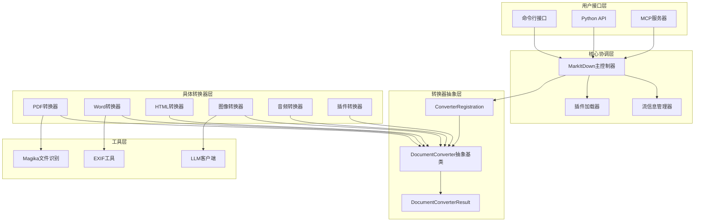
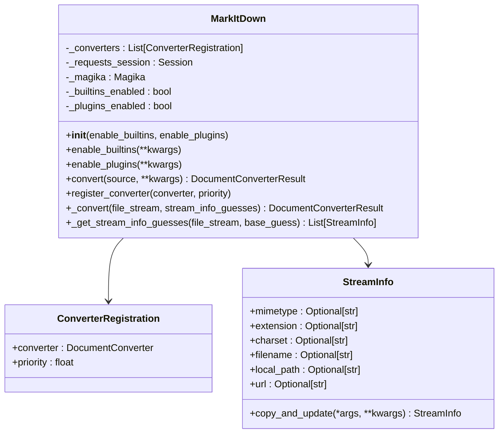
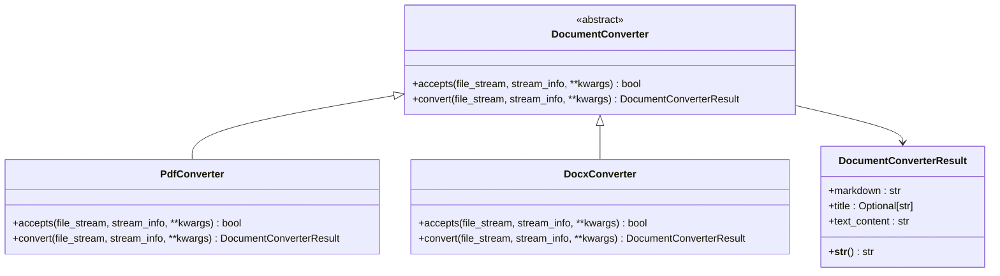
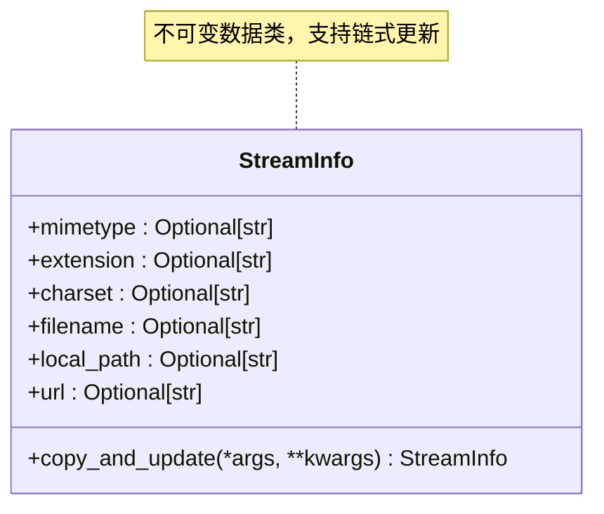
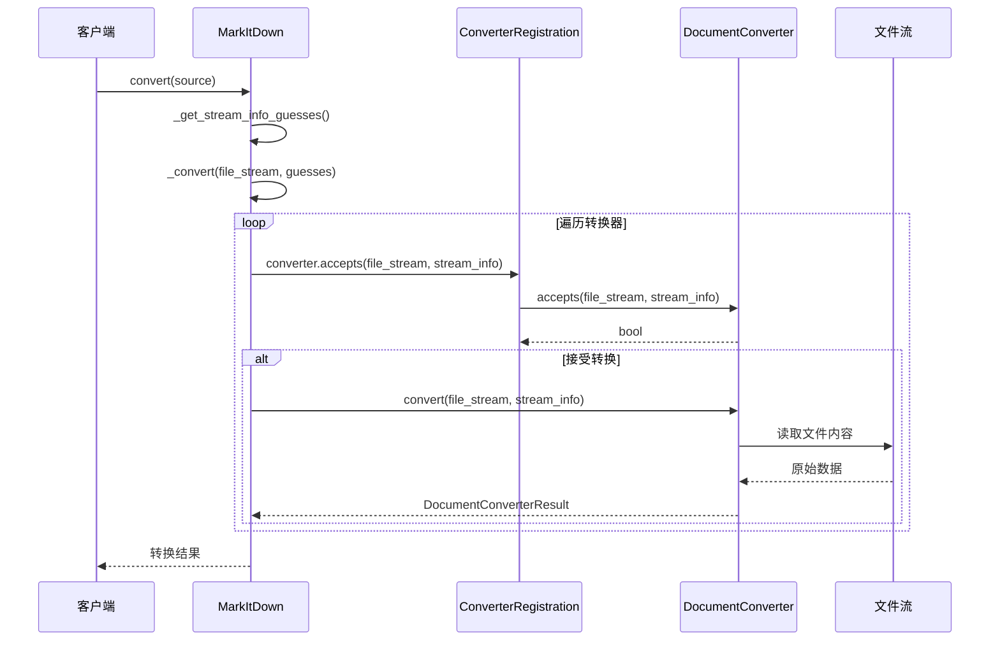
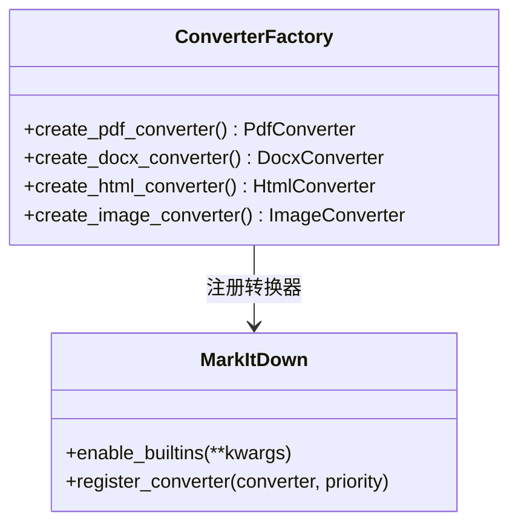
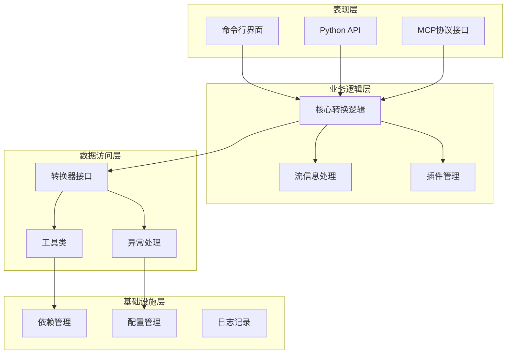
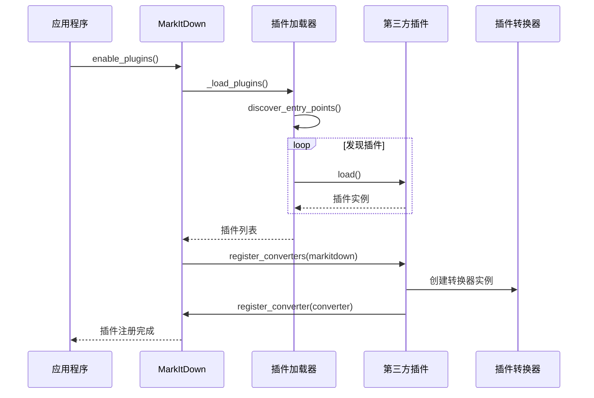
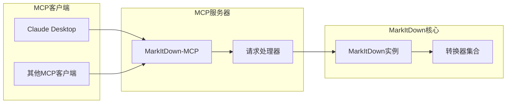

# MarkItDown项目概述

<cite>
**本文档中引用的文件**
- [README.md](file://README.md)
- [_markitdown.py](file://packages/markitdown/src/markitdown/_markitdown.py)
- [_base_converter.py](file://packages/markitdown/src/markitdown/_base_converter.py)
- [_stream_info.py](file://packages/markitdown/src/markitdown/_stream_info.py)
- [_exceptions.py](file://packages/markitdown/src/markitdown/_exceptions.py)
- [pyproject.toml](file://packages/markitdown/pyproject.toml)
- [__init__.py](file://packages/markitdown/src/markitdown/__init__.py)
- [_pdf_converter.py](file://packages/markitdown/src/markitdown/converters/_pdf_converter.py)
- [_docx_converter.py](file://packages/markitdown/src/markitdown/converters/_docx_converter.py)
- [_plugin.py](file://packages/markitdown-sample-plugin/src/markitdown_sample_plugin/_plugin.py)
- [README.md](file://packages/markitdown-mcp/README.md)
</cite>

## 目录
1. [项目简介](#项目简介)
2. [核心价值与应用场景](#核心价值与应用场景)
3. [项目架构概览](#项目架构概览)
4. [核心组件分析](#核心组件分析)
5. [设计模式应用](#设计模式应用)
6. [模块化设计原则](#模块化设计原则)
7. [扩展性与插件系统](#扩展性与插件系统)
8. [性能考虑](#性能考虑)
9. [总结](#总结)

## 项目简介

MarkItDown是一个轻量级的Python实用工具，专门用于将各种文件格式转换为Markdown格式，特别适用于大型语言模型（LLM）和相关文本分析管道。该项目旨在解决文档转换领域的关键挑战：在保持重要文档结构和内容的同时，生成高质量的Markdown输出。

### 主要特性

- **多格式支持**：支持PDF、PowerPoint、Word、Excel、图像、音频、HTML、文本格式、ZIP文件、YouTube链接、EPUB等多种文件格式
- **LLM友好**：输出的Markdown格式与主流LLM（如OpenAI的GPT-4o）天然兼容
- **模块化架构**：采用清晰的分层架构和插件系统
- **智能识别**：使用Magika进行文件类型智能识别
- **可扩展性**：支持第三方插件开发

**章节来源**
- [README.md](file://README.md#L1-L50)
- [pyproject.toml](file://packages/markitdown/pyproject.toml#L1-L20)

## 核心价值与应用场景

### 文档索引与检索

MarkItDown在文档索引系统中发挥着关键作用，通过将各种格式的文档转换为统一的Markdown格式，为搜索引擎和知识管理系统提供标准化的文本输入。

### 大语言模型处理

项目特别针对LLM优化：
- **原生兼容性**：输出格式与GPT-4o等主流LLM的训练数据高度兼容
- **标记效率**：Markdown格式具有出色的token效率
- **结构保留**：在转换过程中尽可能保留文档的层次结构和语义信息

### 文本分析管道

在文本分析工作流中，MarkItDown提供了：
- **统一输入格式**：将异构文档源转换为一致的Markdown格式
- **预处理能力**：内置多种格式的预处理功能
- **质量保证**：提供详细的错误处理和转换结果验证

**章节来源**
- [README.md](file://README.md#L20-L40)

## 项目架构概览

MarkItDown采用清晰的分层架构设计，体现了现代软件工程的最佳实践。



**图表来源**
- [_markitdown.py](file://packages/markitdown/src/markitdown/_markitdown.py#L80-L150)
- [_base_converter.py](file://packages/markitdown/src/markitdown/_base_converter.py#L40-L80)

### 架构设计原则

1. **单一职责原则**：每个组件都有明确的职责边界
2. **开闭原则**：对扩展开放，对修改封闭
3. **依赖倒置原则**：高层模块不依赖低层模块的具体实现
4. **接口隔离原则**：提供细粒度的接口定义

**章节来源**
- [_markitdown.py](file://packages/markitdown/src/markitdown/_markitdown.py#L80-L200)

## 核心组件分析

### MarkItDown类 - 协调中心

MarkItDown类是整个系统的核心协调器，负责管理转换器注册、流信息处理和转换流程控制。



**图表来源**
- [_markitdown.py](file://packages/markitdown/src/markitdown/_markitdown.py#L80-L120)
- [_stream_info.py](file://packages/markitdown/src/markitdown/_stream_info.py#L5-L30)

#### 核心功能

1. **转换器管理**：注册和管理各种文档转换器
2. **流信息处理**：智能推断文件类型和编码
3. **转换流程控制**：实现责任链模式的转换尝试机制
4. **插件集成**：支持第三方插件扩展

**章节来源**
- [_markitdown.py](file://packages/markitdown/src/markitdown/_markitdown.py#L80-L300)

### DocumentConverter抽象基类 - 统一接口

DocumentConverter定义了所有转换器必须遵循的标准接口，确保系统的可扩展性和一致性。



**图表来源**
- [_base_converter.py](file://packages/markitdown/src/markitdown/_base_converter.py#L40-L105)

#### 接口设计特点

1. **accepts方法**：快速判断是否能处理特定文件
2. **convert方法**：执行实际的转换操作
3. **异常处理**：统一的异常处理机制
4. **流式处理**：支持二进制流的高效处理

**章节来源**
- [_base_converter.py](file://packages/markitdown/src/markitdown/_base_converter.py#L40-L105)

### 流信息管理系统

StreamInfo类封装了文件的所有元数据信息，为转换器提供统一的信息访问接口。



**图表来源**
- [_stream_info.py](file://packages/markitdown/src/markitdown/_stream_info.py#L5-L30)

**章节来源**
- [_stream_info.py](file://packages/markitdown/src/markitdown/_stream_info.py#L1-L33)

## 设计模式应用

### 策略模式的实现

MarkItDown大量使用策略模式来处理不同类型的文件转换。



**图表来源**
- [_markitdown.py](file://packages/markitdown/src/markitdown/_markitdown.py#L500-L600)

#### 策略模式优势

1. **算法封装**：每种文件格式的转换逻辑独立封装
2. **运行时选择**：根据文件特征动态选择合适的转换策略
3. **易于扩展**：新增文件格式只需添加新的转换器类

**章节来源**
- [_markitdown.py](file://packages/markitdown/src/markitdown/_markitdown.py#L500-L650)

### 责任链模式的应用

MarkItDown实现了类似责任链模式的转换流程，按照优先级顺序尝试不同的转换器。

```mermaid
flowchart TD
Start([开始转换]) --> GetGuesses[获取流信息猜测]
GetGuesses --> SortConverters[按优先级排序转换器]
SortConverters --> LoopConverters{遍历转换器}
LoopConverters --> CheckAccepts{accepts()返回真?}
CheckAccepts --> |是| TryConvert[尝试转换]
CheckAccepts --> |否| NextConverter[下一个转换器]
TryConvert --> ConvertSuccess{转换成功?}
ConvertSuccess --> |是| ReturnResult[返回结果]
ConvertSuccess --> |否| RecordFailure[记录失败尝试]
RecordFailure --> NextConverter
NextConverter --> MoreConverters{还有转换器?}
MoreConverters --> |是| LoopConverters
MoreConverters --> |否| ThrowException[抛出异常]
ReturnResult --> End([结束])
ThrowException --> End
```

**图表来源**
- [_markitdown.py](file://packages/markitdown/src/markitdown/_markitdown.py#L500-L620)

#### 责任链模式特点

1. **有序尝试**：转换器按照优先级顺序被尝试
2. **短路机制**：一旦找到合适的转换器就停止
3. **容错处理**：即使某个转换器失败，也会尝试其他选项

**章节来源**
- [_markitdown.py](file://packages/markitdown/src/markitdown/_markitdown.py#L500-L650)

### 工厂模式的体现

MarkItDown使用工厂模式来创建和管理转换器实例。



**图表来源**
- [_markitdown.py](file://packages/markitdown/src/markitdown/_markitdown.py#L150-L200)

**章节来源**
- [_markitdown.py](file://packages/markitdown/src/markitdown/_markitdown.py#L150-L250)

## 模块化设计原则

### 分层架构风格

MarkItDown采用经典的分层架构，每一层都有明确的职责和边界。



**图表来源**
- [_markitdown.py](file://packages/markitdown/src/markitdown/_markitdown.py#L1-L50)
- [_base_converter.py](file://packages/markitdown/src/markitdown/_base_converter.py#L1-L30)

### 模块间通信

各模块通过明确定义的接口进行通信，避免紧耦合：

1. **接口契约**：DocumentConverter定义了标准接口
2. **事件驱动**：插件系统通过事件机制扩展功能
3. **配置传递**：通过kwargs参数传递配置信息

**章节来源**
- [_markitdown.py](file://packages/markitdown/src/markitdown/_markitdown.py#L1-L100)

## 扩展性与插件系统

### 插件架构设计

MarkItDown提供了强大的插件系统，支持第三方开发者扩展功能。



**图表来源**
- [_markitdown.py](file://packages/markitdown/src/markitdown/_markitdown.py#L50-L80)
- [_plugin.py](file://packages/markitdown-sample-plugin/src/markitdown_sample_plugin/_plugin.py#L20-L30)

### 插件开发指南

基于样本插件的分析，插件开发遵循以下模式：

1. **接口实现**：继承DocumentConverter基类
2. **入口点注册**：通过entry_points注册
3. **优先级控制**：通过priority参数控制执行顺序
4. **异常处理**：遵循统一的异常处理规范

**章节来源**
- [_plugin.py](file://packages/markitdown-sample-plugin/src/markitdown_sample_plugin/_plugin.py#L1-L72)

### MCP集成

MarkItDown还提供了MCP（Model Context Protocol）服务器，支持与Claude Desktop等AI应用的集成。



**图表来源**
- [README.md](file://packages/markitdown-mcp/README.md#L1-L40)

**章节来源**
- [README.md](file://packages/markitdown-mcp/README.md#L1-L109)

## 性能考虑

### 流式处理优化

MarkItDown采用流式处理策略，避免将大文件完全加载到内存：

1. **二进制流处理**：支持BinaryIO接口的流对象
2. **内存映射**：对于非可寻址流，自动缓存到内存
3. **增量转换**：支持增量处理大型文档

### 并发处理

虽然当前版本主要是单线程的，但架构设计支持未来的并发扩展：

1. **无状态设计**：转换器设计为无状态，便于并发使用
2. **资源池化**：可以为不同类型的转换器维护资源池
3. **异步支持**：底层依赖requests库，支持异步HTTP请求

### 缓存策略

1. **Magika缓存**：使用Magika进行文件类型识别，支持缓存
2. **转换结果缓存**：可以通过外部缓存机制实现
3. **依赖检查缓存**：避免重复检查可选依赖

## 总结

MarkItDown项目展现了优秀的软件架构设计和工程实践。通过采用策略模式、责任链模式和工厂模式，项目实现了高度的可扩展性和维护性。其模块化设计原则确保了代码的清晰性和可测试性，而强大的插件系统则为社区贡献提供了便利。

### 技术亮点

1. **统一接口设计**：DocumentConverter抽象基类提供了清晰的扩展点
2. **智能转换流程**：基于优先级的责任链模式确保最佳转换效果
3. **灵活的插件系统**：支持第三方扩展，促进生态系统发展
4. **LLM优化**：专门针对大型语言模型需求进行优化

### 应用价值

MarkItDown不仅是一个实用的文档转换工具，更是现代软件架构设计的优秀范例。它展示了如何通过合理的架构设计，在保持代码简洁性的同时，实现高度的功能扩展性和系统稳定性。

对于初学者而言，该项目提供了学习现代软件设计模式和架构原则的绝佳案例；对于经验丰富的开发者，它展示了如何构建可扩展、可维护的企业级应用程序。