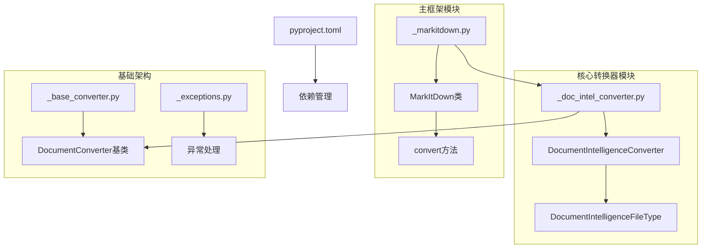
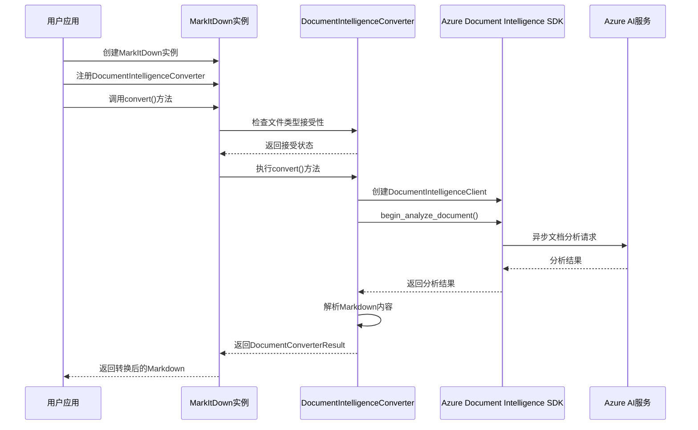
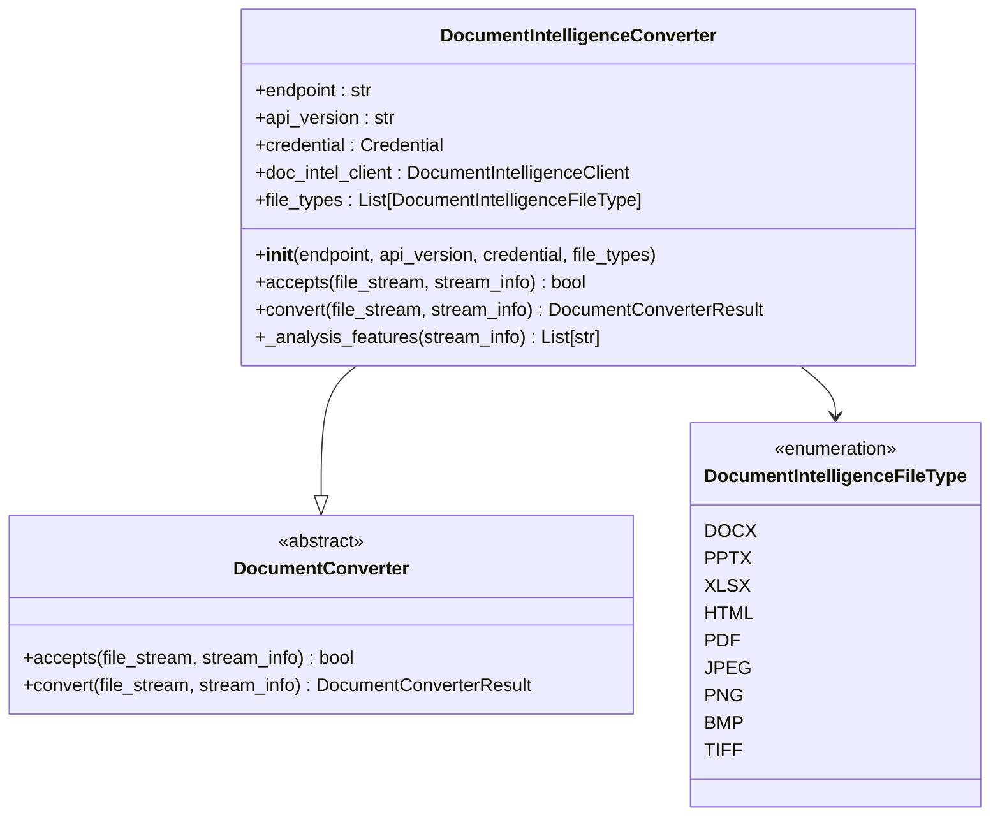
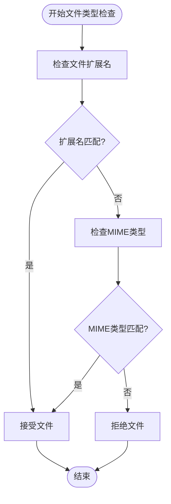
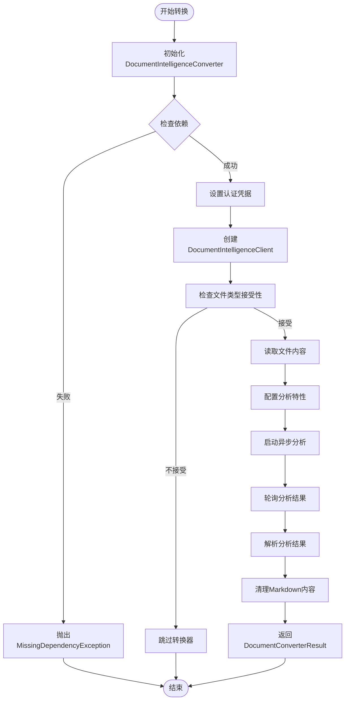
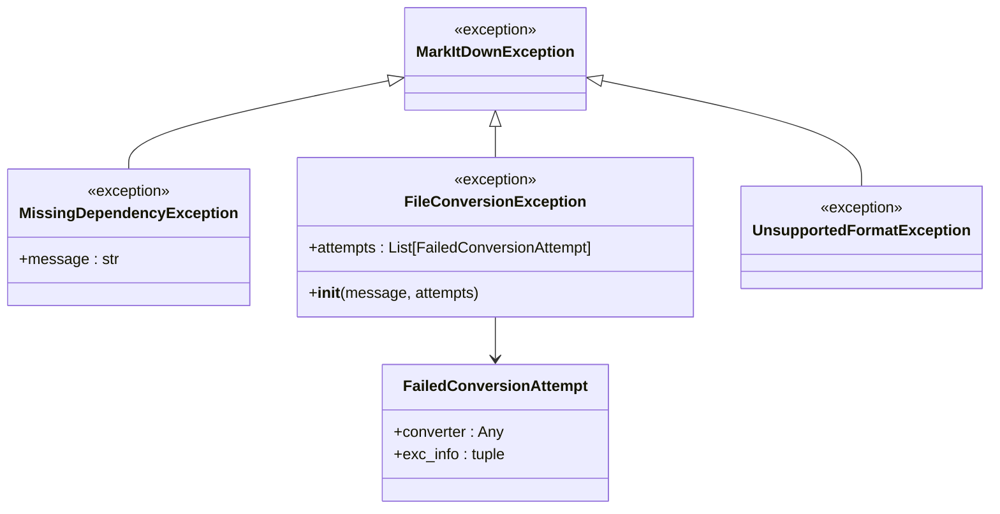

# Azure Document Intelligence 集成

<cite>
**本文档中引用的文件**
- [_doc_intel_converter.py](file://packages/markitdown/src/markitdown/converters/_doc_intel_converter.py)
- [_markitdown.py](file://packages/markitdown/src/markitdown/src/markitdown/_markitdown.py)
- [_base_converter.py](file://packages/markitdown/src/markitdown/src/markitdown/_base_converter.py)
- [_exceptions.py](file://packages/markitdown/src/markitdown/src/markitdown/_exceptions.py)
- [test_docintel_html.py](file://packages/markitdown/src/markitdown/tests/test_docintel_html.py)
- [pyproject.toml](file://packages/markitdown/pyproject.toml)
- [README.md](file://README.md)
</cite>

## 目录
1. [简介](#简介)
2. [项目结构](#项目结构)
3. [核心组件](#核心组件)
4. [架构概览](#架构概览)
5. [详细组件分析](#详细组件分析)
6. [配置参数详解](#配置参数详解)
7. [转换流程](#转换流程)
8. [错误处理机制](#错误处理机制)
9. [性能优化建议](#性能优化建议)
10. [实际代码示例](#实际代码示例)
11. [故障排除指南](#故障排除指南)
12. [结论](#结论)

## 简介

Azure Document Intelligence（以前称为Form Recognizer）是微软提供的强大文档分析服务，能够从各种格式的文档中提取文本、布局、表格、签名和关键信息。MarkItDown项目集成了这一服务，通过`DocumentIntelligenceConverter`类提供了对Azure Document Intelligence API的全面支持。

该集成允许用户将PDF、图像、Word文档等复杂格式的文件转换为结构化的Markdown格式，特别适用于需要与大型语言模型(LLM)配合使用的场景。转换后的Markdown内容保留了原始文档的结构信息，包括标题、列表、表格和链接等重要元素。

## 项目结构

MarkItDown项目采用模块化架构设计，Azure Document Intelligence集成主要分布在以下关键文件中：



**图表来源**
- [_doc_intel_converter.py](file://packages/markitdown/src/markitdown/converters/_doc_intel_converter.py#L1-L255)
- [_markitdown.py](file://packages/markitdown/src/markitdown/src/markitdown/_markitdown.py#L1-L777)

**章节来源**
- [_doc_intel_converter.py](file://packages/markitdown/src/markitdown/converters/_doc_intel_converter.py#L1-L50)
- [_markitdown.py](file://packages/markitdown/src/markitdown/src/markitdown/_markitdown.py#L198-L222)

## 核心组件

### DocumentIntelligenceConverter类

`DocumentIntelligenceConverter`是Azure Document Intelligence集成的核心类，继承自`DocumentConverter`基类。它负责：

- 初始化Azure Document Intelligence客户端
- 处理不同文件类型的接受判断
- 执行异步文档分析
- 解析分析结果并转换为Markdown格式

### 支持的文件类型

系统支持多种文件格式，分为两类：

**无OCR处理的文件类型：**
- DOCX文档
- PPTX演示文稿  
- XLSX电子表格
- HTML网页

**需要OCR处理的文件类型：**
- PDF文档
- JPEG图像
- PNG图像
- BMP位图
- TIFF图像

**章节来源**
- [_doc_intel_converter.py](file://packages/markitdown/src/markitdown/converters/_doc_intel_converter.py#L69-L85)

## 架构概览

Azure Document Intelligence集成采用了分层架构设计，确保了良好的可扩展性和维护性：



**图表来源**
- [_markitdown.py](file://packages/markitdown/src/markitdown/src/markitdown/_markitdown.py#L300-L400)
- [_doc_intel_converter.py](file://packages/markitdown/src/markitdown/converters/_doc_intel_converter.py#L236-L253)

## 详细组件分析

### DocumentIntelligenceConverter初始化



**图表来源**
- [_doc_intel_converter.py](file://packages/markitdown/src/markitdown/converters/_doc_intel_converter.py#L132-L195)
- [_base_converter.py](file://packages/markitdown/src/markitdown/src/markitdown/_base_converter.py#L40-L105)

### 文件类型检测机制

转换器实现了智能的文件类型检测机制，支持基于文件扩展名和MIME类型的双重验证：



**图表来源**
- [_doc_intel_converter.py](file://packages/markitdown/src/markitdown/converters/_doc_intel_converter.py#L175-L195)

**章节来源**
- [_doc_intel_converter.py](file://packages/markitdown/src/markitdown/converters/_doc_intel_converter.py#L175-L195)

### 分析特性配置

根据不同的文件类型，系统会自动配置相应的分析特性：

| 文件类型类别 | OCR支持 | 分析特性 |
|-------------|---------|----------|
| DOCX/PPTX/XLSX/HTML | 否 | 无额外特性 |
| PDF/JPEG/PNG/BMP/TIFF | 是 | 公式提取、高分辨率OCR、字体样式提取 |

**章节来源**
- [_doc_intel_converter.py](file://packages/markitdown/src/markitdown/converters/_doc_intel_converter.py#L197-L234)

## 配置参数详解

### docintel_endpoint

**作用：** 指定Azure Document Intelligence服务的端点URL。

**获取方式：**
1. 登录Azure门户
2. 导航到Document Intelligence资源
3. 在"概述"页面复制"终结点"字段

**示例值：**
```
https://your-resource-name.cognitiveservices.azure.com/
```

### credential

**作用：** 验证身份凭据，用于访问Azure Document Intelligence服务。

**支持的凭据类型：**

| 凭据类型 | 描述 | 使用场景 |
|---------|------|----------|
| AzureKeyCredential | 使用API密钥进行身份验证 | 开发环境、CI/CD管道 |
| TokenCredential | 使用OAuth令牌进行身份验证 | 生产环境、企业集成 |
| DefaultAzureCredential | 自动选择最佳凭据方式 | 灵活的身份验证 |

**获取方式：**
- **API密钥：** 在Azure门户的Document Intelligence资源中获取"密钥和终结点"
- **环境变量：** 设置`AZURE_API_KEY`环境变量

### docintel_api_version

**作用：** 指定要使用的API版本。

**默认值：** `"2024-07-31-preview"`

**可用版本：**
- `2024-07-31-preview`（最新稳定版）
- `2023-10-31-preview`（较旧版本）

**章节来源**
- [_doc_intel_converter.py](file://packages/markitdown/src/markitdown/converters/_doc_intel_converter.py#L132-L160)
- [_markitdown.py](file://packages/markitdown/src/markitdown/src/markitdown/_markitdown.py#L198-L222)

## 转换流程

### 完整转换流程



**图表来源**
- [_doc_intel_converter.py](file://packages/markitdown/src/markitdown/converters/_doc_intel_converter.py#L159-L253)

### 关键步骤详解

#### 1. 依赖检查
系统在初始化时会检查`azure-ai-documentintelligence`和`azure-identity`包是否已安装。如果未安装，会抛出`MissingDependencyException`异常。

#### 2. 认证设置
- 优先使用显式提供的凭据
- 如果未提供凭据且存在`AZURE_API_KEY`环境变量，则使用API密钥
- 否则使用`DefaultAzureCredential`自动选择最佳凭据方式

#### 3. 异步分析
使用`begin_analyze_document()`方法启动异步分析，指定：
- `model_id`: `"prebuilt-layout"` - 布局分析模型
- `body`: 文档字节流
- `features`: 根据文件类型配置的分析特性
- `output_content_format`: 输出格式为Markdown

#### 4. 结果解析
- 等待分析完成并获取结果
- 移除Markdown中的注释内容
- 返回结构化的Markdown文本

**章节来源**
- [_doc_intel_converter.py](file://packages/markitdown/src/markitdown/converters/_doc_intel_converter.py#L159-L253)

## 错误处理机制

### 异常类型层次结构



**图表来源**
- [_exceptions.py](file://packages/markitdown/src/markitdown/src/markitdown/_exceptions.py#L1-L77)

### 常见错误场景及处理策略

#### 1. 依赖缺失
**错误信息：** `DocumentIntelligenceConverter requires the optional dependency [az-doc-intel] (or [all]) to be installed`

**解决方案：**
```bash
pip install markitdown[az-doc-intel]
# 或者
pip install azure-ai-documentintelligence azure-identity
```

#### 2. 认证失败
**可能原因：**
- API密钥无效
- 网络连接问题
- 服务端点配置错误

**解决方案：**
- 验证API密钥的有效性
- 检查网络连接
- 确认服务端点URL正确

#### 3. 配额超限
**错误表现：** 请求被拒绝或返回HTTP 429状态码

**解决方案：**
- 实现重试机制
- 监控使用量
- 升级服务层级

#### 4. 文件格式不支持
**错误表现：** `accepts()`方法返回False

**解决方案：**
- 检查文件扩展名或MIME类型
- 使用支持的文件格式

**章节来源**
- [_exceptions.py](file://packages/markitdown/src/markitdown/src/markitdown/_exceptions.py#L1-L77)
- [_doc_intel_converter.py](file://packages/markitdown/src/markitdown/converters/_doc_intel_converter.py#L159-L175)

## 性能优化建议

### 1. 批量处理策略

虽然当前实现是单文件处理，但可以通过以下方式优化批量处理：

```python
# 推荐的批量处理模式
def batch_process_documents(file_paths, converter):
    results = []
    for file_path in file_paths:
        try:
            result = converter.convert(file_path)
            results.append(result)
        except Exception as e:
            print(f"处理文件 {file_path} 失败: {e}")
            continue
    return results
```

### 2. 结果缓存机制

实现基于文件哈希的结果缓存：

```python
import hashlib
import pickle
from pathlib import Path

class DocumentIntelCache:
    def __init__(self, cache_dir="./cache"):
        self.cache_dir = Path(cache_dir)
        self.cache_dir.mkdir(exist_ok=True)
    
    def get_cache_key(self, file_content):
        return hashlib.md5(file_content).hexdigest()
    
    def get_cached_result(self, file_content):
        cache_key = self.get_cache_key(file_content)
        cache_file = self.cache_dir / f"{cache_key}.pkl"
        
        if cache_file.exists():
            with open(cache_file, "rb") as f:
                return pickle.load(f)
        return None
    
    def cache_result(self, file_content, result):
        cache_key = self.get_cache_key(file_content)
        cache_file = self.cache_dir / f"{cache_key}.pkl"
        
        with open(cache_file, "wb") as f:
            pickle.dump(result, f)
```

### 3. 连接池优化

对于大量文档处理，建议使用连接池：

```python
import requests
from requests.adapters import HTTPAdapter
from urllib3.util.retry import Retry

class OptimizedMarkItDown:
    def __init__(self, **kwargs):
        self.markitdown = MarkItDown(**kwargs)
        
        # 配置连接池
        session = requests.Session()
        retry_strategy = Retry(
            total=3,
            backoff_factor=1,
            status_forcelist=[429, 500, 502, 503, 504],
        )
        adapter = HTTPAdapter(
            pool_connections=10,
            pool_maxsize=20,
            max_retries=retry_strategy
        )
        session.mount("http://", adapter)
        session.mount("https://", adapter)
        
        self.markitdown._requests_session = session
```

### 4. 并发处理

使用异步处理提高效率：

```python
import asyncio
from concurrent.futures import ThreadPoolExecutor

async def async_batch_process(files, converter):
    loop = asyncio.get_event_loop()
    
    with ThreadPoolExecutor(max_workers=5) as executor:
        tasks = []
        for file in files:
            task = loop.run_in_executor(
                executor, 
                lambda f: converter.convert(f), 
                file
            )
            tasks.append(task)
        
        results = await asyncio.gather(*tasks, return_exceptions=True)
    
    return results
```

## 实际代码示例

### Python API使用示例

#### 基本使用
```python
from markitdown import MarkItDown

# 创建MarkItDown实例并启用Document Intelligence
md = MarkItDown(docintel_endpoint="https://your-endpoint.cognitiveservices.azure.com/")
result = md.convert("document.pdf")
print(result.text_content)
```

#### 高级配置
```python
from markitdown import MarkItDown
from azure.ai.documentintelligence import DocumentIntelligenceClient
from azure.core.credentials import AzureKeyCredential

# 显式配置凭据
credential = AzureKeyCredential("your-api-key")
md = MarkItDown(
    docintel_endpoint="https://your-endpoint.cognitiveservices.azure.com/",
    docintel_api_version="2024-07-31-preview",
    docintel_credential=credential,
    docintel_file_types=[
        DocumentIntelligenceFileType.PDF,
        DocumentIntelligenceFileType.JPEG,
        DocumentIntelligenceFileType.PNG
    ]
)
```

#### 错误处理示例
```python
from markitdown import MarkItDown
from markitdown._exceptions import MissingDependencyException, FileConversionException

try:
    md = MarkItDown(docintel_endpoint="https://your-endpoint.cognitiveservices.azure.com/")
    result = md.convert("document.pdf")
    print(result.text_content)
except MissingDependencyException as e:
    print(f"缺少依赖: {e}")
    print("请运行: pip install markitdown[az-doc-intel]")
except FileConversionException as e:
    print(f"转换失败: {e}")
    if e.attempts:
        for attempt in e.attempts:
            print(f"转换器 {type(attempt.converter).__name__}: {attempt.exc_info[1]}")
```

### CLI使用示例

#### 基本命令
```bash
# 将PDF转换为Markdown
markitdown document.pdf -o output.md -d -e "https://your-endpoint.cognitiveservices.azure.com/"

# 指定输出文件
markitdown document.pdf -o output.md -d -e "https://your-endpoint.cognitiveservices.azure.com/"
```

#### 环境变量配置
```bash
# 设置API密钥
export AZURE_API_KEY="your-api-key"

# 设置端点
export AZURE_ENDPOINT="https://your-endpoint.cognitiveservices.azure.com/"

# 使用环境变量配置
markitdown document.pdf -o output.md -d
```

### 测试示例

#### 单元测试
```python
import io
from markitdown.converters._doc_intel_converter import (
    DocumentIntelligenceConverter,
    DocumentIntelligenceFileType,
)
from markitdown._stream_info import StreamInfo

def test_docintel_accepts_pdf():
    """测试PDF文件接受性"""
    conv = DocumentIntelligenceConverter.__new__(DocumentIntelligenceConverter)
    conv._file_types = [DocumentIntelligenceFileType.PDF]
    stream_info = StreamInfo(mimetype="application/pdf", extension=".pdf")
    assert conv.accepts(io.BytesIO(b""), stream_info)

def test_docintel_converts_correctly():
    """测试Markdown转换"""
    # 注意：实际测试需要Mock Azure服务
    pass
```

**章节来源**
- [README.md](file://README.md#L140-L184)
- [_doc_intel_converter.py](file://packages/markitdown/src/markitdown/converters/_doc_intel_converter.py#L132-L253)

## 故障排除指南

### 常见问题及解决方案

#### 1. 依赖安装问题
**问题：** `MissingDependencyException`异常

**诊断步骤：**
```bash
# 检查是否安装了必要的依赖
pip show azure-ai-documentintelligence azure-identity

# 如果未安装，执行以下命令
pip install markitdown[az-doc-intel]
```

#### 2. 认证失败
**问题：** 无法连接到Azure Document Intelligence服务

**诊断步骤：**
1. 验证端点URL格式
2. 检查API密钥有效性
3. 测试网络连接
4. 查看防火墙设置

#### 3. 文件格式问题
**问题：** 文件类型不被支持

**解决方案：**
```python
# 检查支持的文件类型
from markitdown.converters._doc_intel_converter import DocumentIntelligenceFileType

supported_types = [
    DocumentIntelligenceFileType.PDF,
    DocumentIntelligenceFileType.JPEG,
    DocumentIntelligenceFileType.PNG,
    DocumentIntelligenceFileType.DOCX,
    DocumentIntelligenceFileType.PPTX,
    DocumentIntelligenceFileType.XLSX,
    DocumentIntelligenceFileType.HTML
]

# 手动检查文件类型
def check_supported_type(file_path):
    import mimetypes
    from pathlib import Path
    
    ext = Path(file_path).suffix.lower()
    mime_type, _ = mimetypes.guess_type(file_path)
    
    print(f"文件扩展名: {ext}")
    print(f"MIME类型: {mime_type}")
    print(f"支持的扩展名: {[ft.value for ft in supported_types]}")
```

#### 4. 性能问题
**问题：** 转换速度慢或超时

**优化建议：**
- 检查网络连接质量
- 考虑使用本地缓存
- 实现并发处理
- 监控API使用量

### 调试技巧

#### 启用详细日志
```python
import logging
logging.basicConfig(level=logging.DEBUG)

# 在代码中添加调试信息
def debug_conversion(file_path):
    from markitdown import MarkItDown
    import time
    
    start_time = time.time()
    md = MarkItDown(docintel_endpoint="your-endpoint")
    
    try:
        result = md.convert(file_path)
        duration = time.time() - start_time
        print(f"转换成功，耗时: {duration:.2f}秒")
        return result
    except Exception as e:
        print(f"转换失败: {e}")
        raise
```

#### 性能监控
```python
import time
from functools import wraps

def monitor_performance(func):
    @wraps(func)
    def wrapper(*args, **kwargs):
        start_time = time.time()
        result = func(*args, **kwargs)
        duration = time.time() - start_time
        print(f"{func.__name__} 耗时: {duration:.2f}秒")
        return result
    return wrapper

@monitor_performance
def convert_with_monitoring(file_path):
    from markitdown import MarkItDown
    md = MarkItDown(docintel_endpoint="your-endpoint")
    return md.convert(file_path)
```

**章节来源**
- [_exceptions.py](file://packages/markitdown/src/markitdown/src/markitdown/_exceptions.py#L1-L77)
- [test_docintel_html.py](file://packages/markitdown/src/markitdown/tests/test_docintel_html.py#L1-L27)

## 结论

Azure Document Intelligence集成为MarkItDown项目提供了强大的文档转换能力，能够处理复杂的文档格式并生成高质量的Markdown输出。通过合理的配置和优化，该集成可以满足各种文档处理需求，特别是在与大型语言模型配合使用的场景中表现出色。

### 主要优势

1. **广泛的文件格式支持** - 支持PDF、图像、Office文档等多种格式
2. **高质量的转换结果** - 保留文档结构和格式信息
3. **灵活的配置选项** - 支持多种认证方式和API版本
4. **完善的错误处理** - 提供详细的异常信息和恢复策略
5. **可扩展的架构** - 易于集成到现有系统中

### 最佳实践建议

1. **合理配置文件类型过滤** - 只启用需要的文件类型以提高性能
2. **实施适当的缓存策略** - 对重复处理的文档使用缓存
3. **监控API使用量** - 避免超出配额限制
4. **实现重试机制** - 处理临时性故障
5. **定期更新SDK版本** - 获取最新的功能和修复

通过遵循本文档中的指导原则和最佳实践，开发者可以充分利用Azure Document Intelligence集成的强大功能，构建高效可靠的文档处理解决方案。