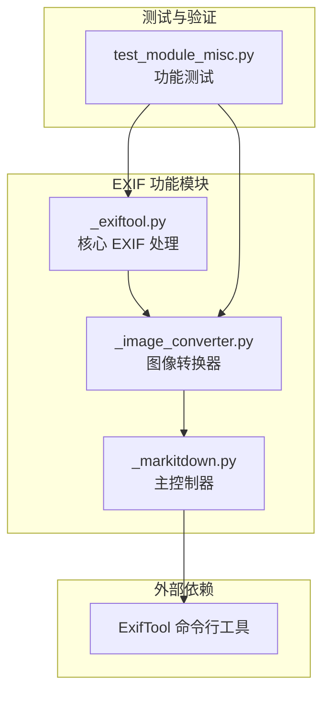
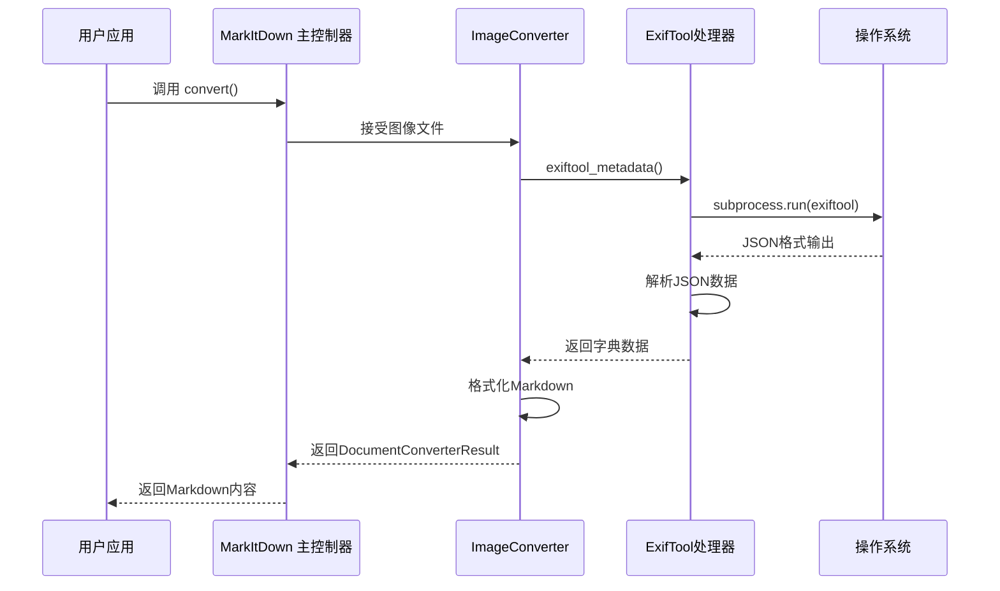
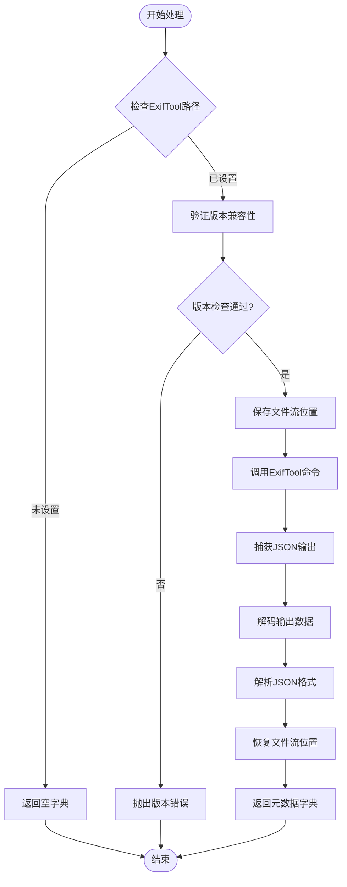
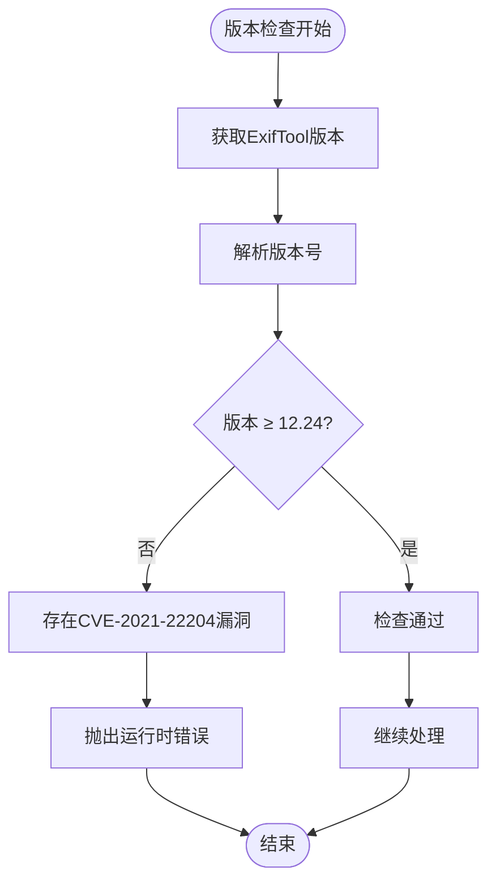
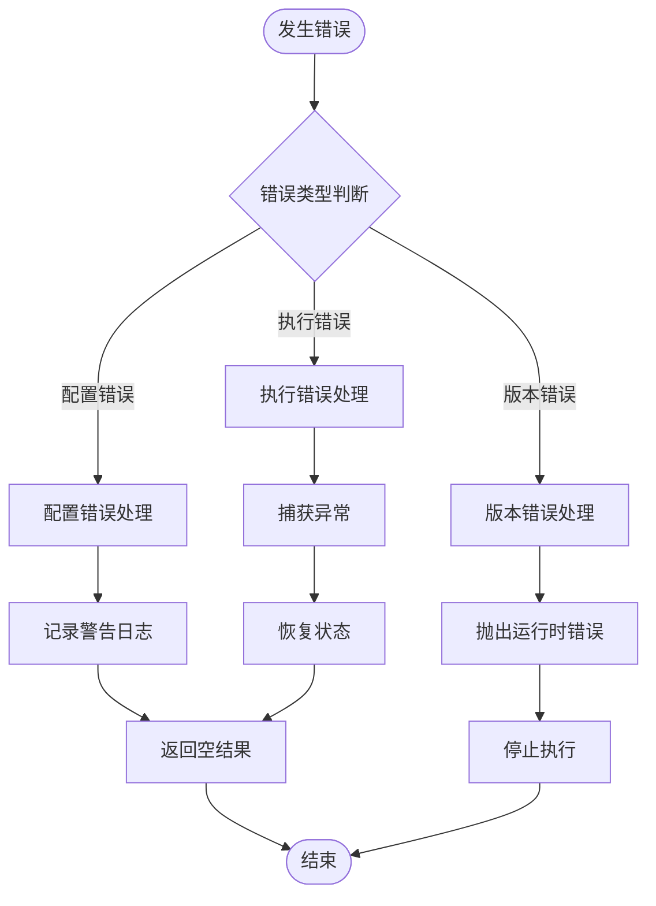
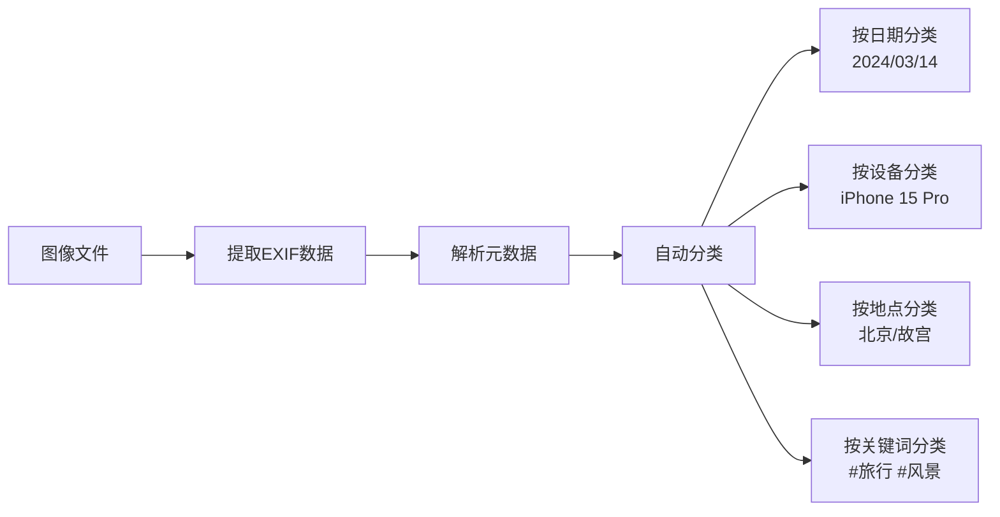

# EXIF 元数据提取功能详细说明

<cite>
**本文档引用的文件**
- [_exiftool.py](file://packages/markitdown/src/markitdown/converters/_exiftool.py)
- [_image_converter.py](file://packages/markitdown/src/markitdown/converters/_image_converter.py)
- [_markitdown.py](file://packages/markitdown/src/markitdown/_markitdown.py)
- [test_module_misc.py](file://packages/markitdown/tests/test_module_misc.py)
- [README.md](file://README.md)
</cite>

## 目录
1. [简介](#简介)
2. [项目结构概览](#项目结构概览)
3. [核心组件分析](#核心组件分析)
4. [架构设计](#架构设计)
5. [详细组件分析](#详细组件分析)
6. [依赖项与安装要求](#依赖项与安装要求)
7. [错误处理机制](#错误处理机制)
8. [实际应用场景](#实际应用场景)
9. [故障排除指南](#故障排除指南)
10. [总结](#总结)

## 简介

MarkItDown 的 EXIF 元数据提取功能是一个强大的工具，专门用于从图像和音频文件中提取嵌入的元数据信息。该功能通过调用系统级的 ExifTool 命令行工具，能够解析复杂的 EXIF 数据并将其转换为结构化的 Markdown 格式，为文档组织和智能检索提供了重要支持。

EXIF（Exchangeable Image File Format）元数据包含了丰富的信息，包括拍摄时间、设备型号、地理位置、作者信息等。MarkItDown 的 EXIF 提取功能不仅支持标准的 EXIF 字段，还能够处理 GPS 位置信息、关键词标签等高级元数据。

## 项目结构概览

EXIF 功能在 MarkItDown 项目中的组织结构体现了模块化的设计理念：



**图表来源**
- [_exiftool.py](file://packages/markitdown/src/markitdown/converters/_exiftool.py#L1-L53)
- [_image_converter.py](file://packages/markitdown/src/markitdown/converters/_image_converter.py#L1-L139)
- [_markitdown.py](file://packages/markitdown/src/markitdown/_markitdown.py#L110-L170)

**章节来源**
- [_exiftool.py](file://packages/markitdown/src/markitdown/converters/_exiftool.py#L1-L53)
- [_image_converter.py](file://packages/markitdown/src/markitdown/converters/_image_converter.py#L1-L139)

## 核心组件分析

### _exiftool.py - EXIF 核心处理模块

_exiftool.py 模块是整个 EXIF 功能的核心，负责与系统级 ExifTool 工具的交互和数据解析：

#### 主要功能特性：
- **版本验证**：确保使用安全的 ExifTool 版本（≥12.24）
- **子进程调用**：通过 subprocess 模块执行 ExifTool 命令
- **JSON 输出解析**：将 ExifTool 的 JSON 格式输出转换为 Python 字典
- **流位置管理**：保持文件流的原始位置不变

#### 关键函数：
- `exiftool_metadata()`：主要的 EXIF 数据提取函数
- `_parse_version()`：版本号解析辅助函数

### _image_converter.py - 图像转换器

图像转换器集成了 EXIF 元数据提取功能，为 Markdown 文档添加丰富的前置元数据：

#### 支持的媒体类型：
- JPEG 图像（.jpg, .jpeg）
- PNG 图像（.png）

#### 提取的关键字段：
- ImageSize：图像尺寸
- Title：标题信息
- Caption：标题说明
- Description：详细描述
- Keywords：关键词标签
- Artist/Author：创作者信息
- DateTimeOriginal/CreateDate：拍摄/创建时间
- GPSPosition：地理定位信息

**章节来源**
- [_exiftool.py](file://packages/markitdown/src/markitdown/converters/_exiftool.py#L10-L53)
- [_image_converter.py](file://packages/markitdown/src/markitdown/converters/_image_converter.py#L10-L139)

## 架构设计

EXIF 功能的整体架构采用了分层设计模式，确保了功能的可扩展性和维护性：



**图表来源**
- [_image_converter.py](file://packages/markitdown/src/markitdown/converters/_image_converter.py#L40-L60)
- [_exiftool.py](file://packages/markitdown/src/markitdown/converters/_exiftool.py#L10-L53)

### 数据流处理流程



**图表来源**
- [_exiftool.py](file://packages/markitdown/src/markitdown/converters/_exiftool.py#L10-L53)

**章节来源**
- [_exiftool.py](file://packages/markitdown/src/markitdown/converters/_exiftool.py#L10-L53)
- [_image_converter.py](file://packages/markitdown/src/markitdown/converters/_image_converter.py#L40-L60)

## 详细组件分析

### ExifTool 路径发现机制

MarkItDown 实现了智能的 ExifTool 路径发现机制，支持多种配置方式：

#### 配置优先级顺序：
1. **显式参数指定**：通过 `exiftool_path` 参数直接传入路径
2. **环境变量设置**：读取 `EXIFTOOL_PATH` 环境变量
3. **系统路径查找**：使用 `shutil.which()` 在系统 PATH 中查找
4. **预设路径检查**：在常见安装目录中搜索

#### 支持的操作系统路径：
- **Unix/Linux/macOS**：`/usr/bin`, `/usr/local/bin`, `/opt`, `/opt/bin`, `/opt/local/bin`, `/opt/homebrew/bin`
- **Windows**：`C:\Windows\System32`, `C:\Program Files`, `C:\Program Files (x86)`

### 版本安全检查

为了确保安全性，系统会对 ExifTool 版本进行严格检查：



**图表来源**
- [_exiftool.py](file://packages/markitdown/src/markitdown/converters/_exiftool.py#L18-L30)

### EXIF 数据提取与格式化

图像转换器将提取的 EXIF 数据格式化为 Markdown 前置元数据：

#### 格式化规则：
- 每个字段以 `字段名: 值` 的形式呈现
- 使用换行符分隔不同的字段
- 支持复杂数据类型的处理（如 GPS 位置）

#### 示例输出格式：
```
ImageSize: 1615x1967
Title: AutoGen: Enabling Next-Gen LLM Applications via Multi-Agent Conversation
Description: AutoGen enables diverse LLM-based applications
DateTimeOriginal: 2024:03:14 22:10:00
```

**章节来源**
- [_markitdown.py](file://packages/markitdown/src/markitdown/_markitdown.py#L143-L168)
- [_image_converter.py](file://packages/markitdown/src/markitdown/converters/_image_converter.py#L50-L65)

## 依赖项与安装要求

### 系统级依赖

EXIF 功能的核心依赖是 ExifTool 命令行工具，这是一个 Perl 编写的强大元数据处理工具。

#### 安装方法：

**Ubuntu/Debian:**
```bash
sudo apt-get update
sudo apt-get install libimage-exiftool-perl
```

**macOS (Homebrew):**
```bash
brew install exiftool
```

**Windows:**
1. 下载 ExifTool 安装包
2. 运行安装程序
3. 添加到系统 PATH

**Python 包依赖：**
MarkItDown 本身不需要额外的 Python 包来支持 EXIF 功能，因为它是通过系统命令调用实现的。

### 不同操作系统的配置差异

#### Unix/Linux 系统：
- 默认安装路径：`/usr/bin/exiftool`
- 权限要求：需要执行权限
- 环境变量：通常已包含在 PATH 中

#### macOS 系统：
- Homebrew 安装路径：`/opt/homebrew/bin/exiftool`
- 可能需要 Xcode 命令行工具
- Gatekeeper 签名验证

#### Windows 系统：
- 安装路径：`C:\Program Files\ExifTool\exiftool.exe`
- 需要管理员权限安装
- PATH 环境变量配置

### 验证安装

安装完成后，可以通过以下命令验证 ExifTool 是否正常工作：

```bash
exiftool -ver
# 应该返回类似 12.xx 的版本号
```

**章节来源**
- [_markitdown.py](file://packages/markitdown/src/markitdown/_markitdown.py#L143-L168)
- [README.md](file://README.md#L60-L80)

## 错误处理机制

EXIF 功能实现了多层次的错误处理机制，确保系统的稳定性和用户体验：

### 错误类型分类

#### 1. 配置错误
- **ExifTool 未安装**：检测不到系统级 ExifTool
- **路径配置错误**：指定的 ExifTool 路径无效
- **权限不足**：无法执行 ExifTool 命令

#### 2. 版本兼容性错误
- **过时版本**：ExifTool 版本低于 12.24
- **安全漏洞**：存在已知的安全问题

#### 3. 执行时错误
- **命令执行失败**：subprocess 调用失败
- **JSON 解析错误**：ExifTool 输出格式异常
- **文件流错误**：文件读取或位置恢复失败

### 错误处理策略



**图表来源**
- [_exiftool.py](file://packages/markitdown/src/markitdown/converters/_exiftool.py#L18-L30)

### 具体错误处理实现

#### 版本验证错误处理：
- 检测到低版本时立即终止执行
- 提供明确的升级指导信息
- 记录详细的错误上下文

#### 子进程调用错误处理：
- 捕获 `CalledProcessError` 异常
- 检查返回码和错误输出
- 提供友好的错误消息

#### 文件流位置恢复：
- 使用 `try...finally` 确保资源清理
- 无论成功与否都恢复文件指针位置
- 避免影响后续的文件处理流程

**章节来源**
- [_exiftool.py](file://packages/markitdown/src/markitdown/converters/_exiftool.py#L18-L53)

## 实际应用场景

### 文档管理系统集成

EXIF 元数据提取功能可以深度集成到文档管理系统中，提供智能化的文档组织和检索能力：

#### 自动分类系统：


#### 智能标签系统：
- 自动生成基于拍摄时间的标签
- 提取设备型号作为分类依据
- 利用 GPS 位置信息进行地理标记
- 分析关键词和描述生成语义标签

### 内容管理系统优化

#### SEO 优化：
- 自动生成基于 EXIF 信息的标题和描述
- 提供丰富的元数据用于搜索引擎优化
- 自动生成 alt 文本和图片描述

#### 社交媒体发布：
- 自动添加拍摄时间和地点信息
- 生成适合社交媒体分享的元数据
- 提供多平台兼容的格式转换

### 数字资产管理

#### 资产库管理：
- 自动识别和分类数字资产
- 建立基于元数据的搜索索引
- 实现智能的资产推荐系统

#### 版权保护：
- 记录创作者信息和版权声明
- 跟踪文件的修改历史
- 提供数字水印和版权标记

### 实际应用示例

根据测试文件中的数据，以下是典型的 EXIF 元数据提取结果：

#### JPEG 图像示例：
```
Author: AutoGen Authors
Title: AutoGen: Enabling Next-Gen LLM Applications via Multi-Agent Conversation
Description: AutoGen enables diverse LLM-based applications
ImageSize: 1615x1967
DateTimeOriginal: 2024:03:14 22:10:00
```

#### MP3 音频示例：
```
Title: f67a499e-a7d0-4ca3-a49b-358bd934ae3e
Artist: Artist Name Test String
Album: Album Name Test String
SampleRate: 48000
```

**章节来源**
- [test_module_misc.py](file://packages/markitdown/tests/test_module_misc.py#L38-L50)

## 故障排除指南

### 常见问题诊断

#### 问题 1：ExifTool 未找到
**症状**：程序正常运行但没有 EXIF 数据输出

**诊断步骤**：
1. 检查系统是否安装了 ExifTool
2. 验证 PATH 环境变量配置
3. 测试直接命令行调用

**解决方案**：
```bash
# 检查安装
which exiftool

# 手动测试
echo "test.jpg" | exiftool -
```

#### 问题 2：版本兼容性问题
**症状**：运行时抛出版本验证错误

**诊断步骤**：
1. 获取当前 ExifTool 版本
2. 检查是否满足最低版本要求

**解决方案**：
```bash
# 升级 ExifTool
sudo apt-get update && sudo apt-get install --only-upgrade libimage-exiftool-perl
# 或者下载最新版本
```

#### 问题 3：文件权限错误
**症状**：子进程调用失败，提示权限被拒绝

**诊断步骤**：
1. 检查 ExifTool 可执行文件权限
2. 验证用户对目标文件的访问权限

**解决方案**：
```bash
# 设置执行权限
chmod +x /path/to/exiftool

# 检查文件权限
ls -la test.jpg
```

### 性能优化建议

#### 大文件处理优化：
- 对于超大文件，考虑分块处理
- 实现缓存机制避免重复解析
- 使用异步处理提高并发性能

#### 内存使用优化：
- 及时释放文件流资源
- 控制 JSON 解析缓冲区大小
- 实现流式处理减少内存占用

#### 并发处理策略：
- 使用线程池处理多个文件
- 实现任务队列管理
- 提供进度报告机制

### 调试技巧

#### 启用详细日志：
```python
import logging
logging.basicConfig(level=logging.DEBUG)
```

#### 直接命令行测试：
```bash
# 手动测试 ExifTool 命令
exiftool -json - - < test.jpg
```

#### 文件流状态检查：
```python
# 在转换前后检查文件位置
print(f"Before: {file_stream.tell()}")
# ... 执行转换 ...
print(f"After: {file_stream.tell()}")
```

**章节来源**
- [_exiftool.py](file://packages/markitdown/src/markitdown/converters/_exiftool.py#L18-L53)
- [test_module_misc.py](file://packages/markitdown/tests/test_module_misc.py#L340-L380)

## 总结

MarkItDown 的 EXIF 元数据提取功能代表了现代文档处理技术的一个重要进步。通过巧妙地结合系统级工具和 Python 库，它实现了高效、可靠且功能丰富的元数据提取能力。

### 技术优势

1. **跨平台兼容性**：支持 Windows、macOS 和 Linux 系统
2. **安全性保障**：严格的版本验证机制防止安全漏洞
3. **灵活性设计**：多种配置方式适应不同部署环境
4. **错误处理完善**：多层次的异常处理确保系统稳定性

### 应用价值

- **提升文档质量**：自动生成丰富的元数据信息
- **优化检索效率**：基于 EXIF 数据的智能分类和搜索
- **增强内容管理**：自动化的内容组织和标签系统
- **支持业务需求**：满足企业级文档管理的各种场景

### 发展前景

随着人工智能和大数据技术的发展，EXIF 元数据提取功能将在以下方面得到进一步发展：

- **智能分析**：结合机器学习算法进行更深入的元数据分析
- **实时处理**：支持流式处理和实时元数据提取
- **云端集成**：与云存储和内容管理系统深度集成
- **标准化推进**：推动 EXIF 元数据标准的进一步完善

这个功能不仅展示了 MarkItDown 在文档处理领域的技术实力，也为用户提供了强大的工具来管理和利用他们的数字内容。通过合理配置和使用，它可以显著提升文档处理的效率和质量，为各种应用场景提供强有力的支持。