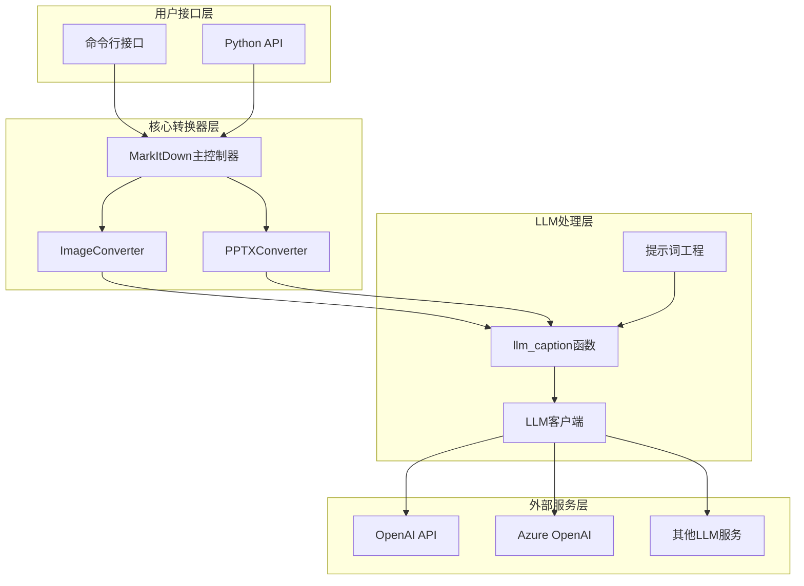
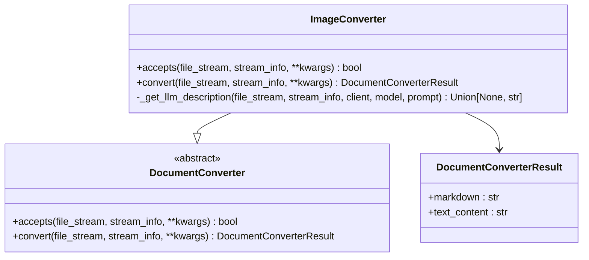
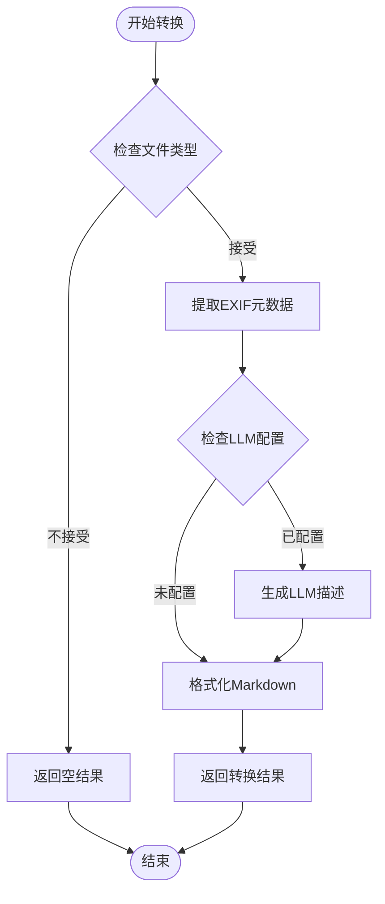
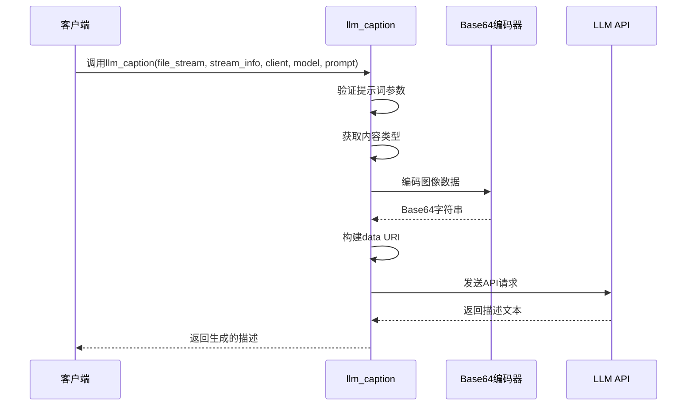
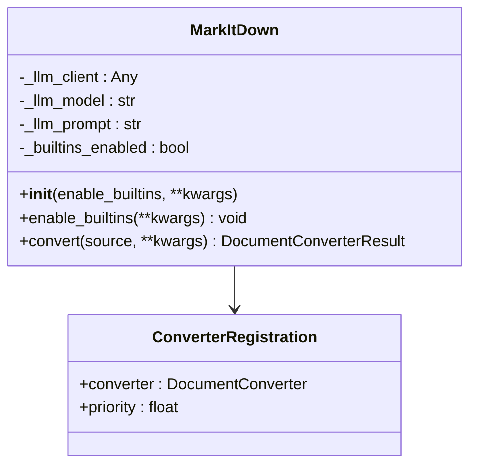
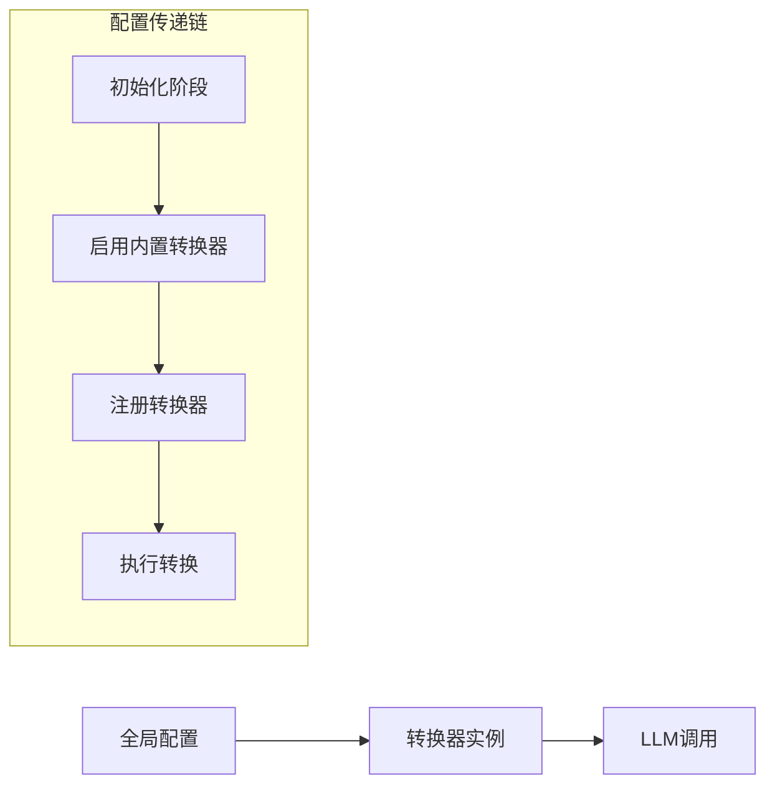
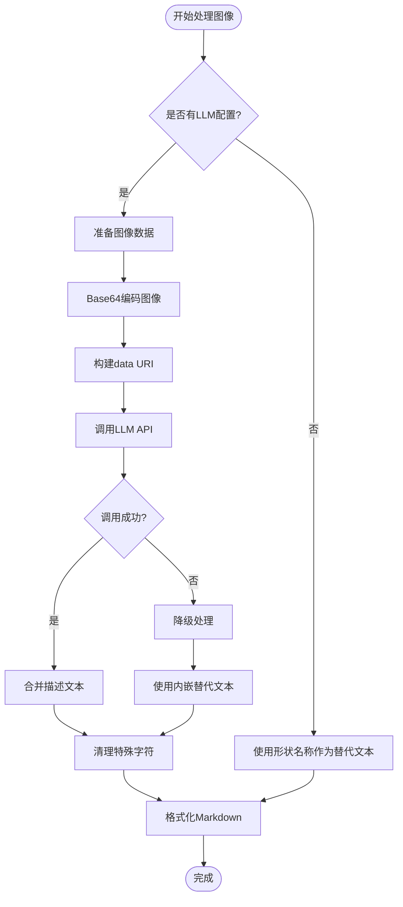
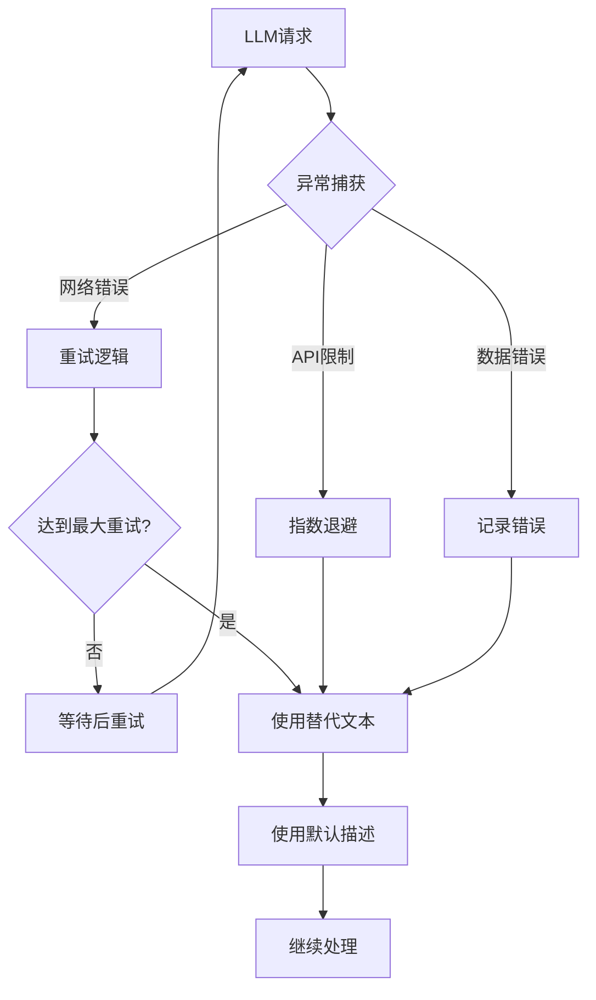
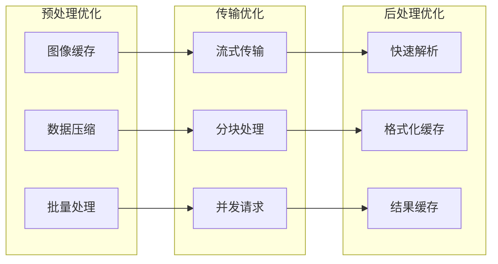
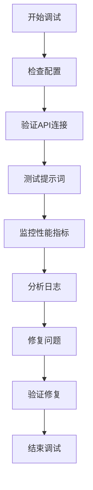

# LLM 图像描述生成技术文档

<cite>
**本文档引用的文件**
- [_image_converter.py](file://packages/markitdown/src/markitdown/converters/_image_converter.py)
- [_llm_caption.py](file://packages/markitdown/src/markitdown/converters/_llm_caption.py)
- [_markitdown.py](file://packages/markitdown/src/markitdown/_markitdown.py)
- [_pptx_converter.py](file://packages/markitdown/src/markitdown/converters/_pptx_converter.py)
- [README.md](file://README.md)
- [test_module_misc.py](file://packages/markitdown/tests/test_module_misc.py)
</cite>

## 目录
1. [简介](#简介)
2. [系统架构概览](#系统架构概览)
3. [_image_converter.py 模块深度分析](#_image_converterpy-模块深度分析)
4. [_llm_caption.py 模块详细解析](#_llm_captionpy-模块详细解析)
5. [LLM 集成配置与初始化](#llm-集成配置与初始化)
6. [图像描述生成流程](#图像描述生成流程)
7. [配置选项详解](#配置选项详解)
8. [与主流LLM服务集成](#与主流llm服务集成)
9. [性能优化与最佳实践](#性能优化与最佳实践)
10. [故障排除指南](#故障排除指南)
11. [总结](#总结)

## 简介

MarkItDown 的 LLM 图像描述功能是一个先进的多模态内容处理系统，能够自动为图像生成详细的描述性文本。该功能通过集成大型语言模型（LLM），特别是支持视觉理解的多模态模型，实现了从图像到结构化 Markdown 内容的智能转换。

核心特性包括：
- 自动检测图像内嵌描述并生成替代文本
- 支持多种图像格式（JPEG、PNG等）
- 可配置的提示词工程
- 错误处理和降级机制
- 与主流 LLM 服务的无缝集成

## 系统架构概览



**图表来源**
- [_markitdown.py](file://packages/markitdown/src/markitdown/_markitdown.py#L106-L147)
- [_image_converter.py](file://packages/markitdown/src/markitdown/converters/_image_converter.py#L17-L139)
- [_llm_caption.py](file://packages/markitdown/src/markitdown/converters/_llm_caption.py#L7-L51)

## _image_converter.py 模块深度分析

### 类结构与职责

ImageConverter 是图像处理的核心类，负责：



**图表来源**
- [_image_converter.py](file://packages/markitdown/src/markitdown/converters/_image_converter.py#L15-L139)

### 接受性检查机制

ImageConverter 实现了严格的文件类型验证：

| 支持的 MIME 类型前缀 | 文件扩展名 | 验证逻辑 |
|---------------------|-----------|----------|
| image/jpeg | .jpg, .jpeg | 扩展名匹配或 MIME 类型前缀匹配 |
| image/png | .png | 同上 |

### 转换流程详解



**图表来源**
- [_image_converter.py](file://packages/markitdown/src/markitdown/converters/_image_converter.py#L25-L82)

**章节来源**
- [_image_converter.py](file://packages/markitdown/src/markitdown/converters/_image_converter.py#L15-L139)

## _llm_caption.py 模块详细解析

### 核心函数设计

llm_caption 函数是独立的 LLM 图像描述生成模块，具有以下特点：



**图表来源**
- [_llm_caption.py](file://packages/markitdown/src/markitdown/converters/_llm_caption.py#L7-L51)

### 数据预处理流程

| 步骤 | 处理内容 | 实现细节 |
|------|----------|----------|
| 内容类型检测 | 获取 MIME 类型 | 使用 stream_info.mimetype 或文件扩展名推断 |
| Base64编码 | 图像数据转换 | 异常处理确保数据完整性 |
| URI构建 | 创建data URI | 格式：data:{content_type};base64,{base64_data} |
| 请求准备 | 构建消息结构 | 包含文本提示和图像URL |

**章节来源**
- [_llm_caption.py](file://packages/markitdown/src/markitdown/converters/_llm_caption.py#L7-L51)

## LLM 集成配置与初始化

### MarkItDown 主控制器配置



**图表来源**
- [_markitdown.py](file://packages/markitdown/src/markitdown/_markitdown.py#L106-L147)

### 初始化参数配置

| 参数名称 | 类型 | 默认值 | 描述 |
|----------|------|--------|------|
| llm_client | Any | None | LLM客户端实例（如OpenAI客户端） |
| llm_model | str | None | 目标模型名称（如"gpt-4o"） |
| llm_prompt | str | None | 自定义提示词模板 |
| enable_builtins | bool | None | 是否启用内置转换器 |

### 全局配置传递机制

系统采用分层配置传递策略：



**图表来源**
- [_markitdown.py](file://packages/markitdown/src/markitdown/_markitdown.py#L557-L564)

**章节来源**
- [_markitdown.py](file://packages/markitdown/src/markitdown/_markitdown.py#L106-L147)
- [_markitdown.py](file://packages/markitdown/src/markitdown/_markitdown.py#L557-L564)

## 图像描述生成流程

### PPTX 文件中的图像处理

PPTX 转换器展示了最完整的 LLM 集成实现：

```mermaid
sequenceDiagram
participant PPTX as PPTXConverter
participant SHAPE as 形状处理器
participant LLM as LLM模块
participant ALT as 替代文本生成
PPTX->>SHAPE : 处理图片形状
SHAPE->>SHAPE : 检查LLM配置
SHAPE->>LLM : 调用llm_caption
LLM->>LLM : 编码图像数据
LLM->>LLM : 构建API请求
LLM-->>SHAPE : 返回描述文本
SHAPE->>ALT : 合并LLM描述和内嵌描述
ALT->>ALT : 处理特殊字符
ALT-->>SHAPE : 返回最终替代文本
SHAPE-->>PPTX : 完成图片处理
```

**图表来源**
- [_pptx_converter.py](file://packages/markitdown/src/markitdown/converters/_pptx_converter.py#L97-L130)

### 图像描述生成决策树



**图表来源**
- [_pptx_converter.py](file://packages/markitdown/src/markitdown/converters/_pptx_converter.py#L97-L130)

**章节来源**
- [_pptx_converter.py](file://packages/markitdown/src/markitdown/converters/_pptx_converter.py#L97-L130)

## 配置选项详解

### 提示词工程配置

| 配置项 | 默认值 | 说明 | 示例 |
|--------|--------|------|------|
| llm_prompt | "Write a detailed caption for this image." | 基础提示词模板 | "请为这张图片写一个详细的描述" |
| 自定义提示词 | 用户定义 | 支持多语言和特定领域 | "分析这张医学影像的主要发现" |

### 模型配置选项

| 模型类型 | 推荐配置 | 性能特点 | 成本考虑 |
|----------|----------|----------|----------|
| GPT-4o | 最佳质量 | 支持视觉理解 | 中等成本 |
| GPT-4 Vision | 高精度 | 专门视觉模型 | 较高成本 |
| Claude系列 | 平衡选择 | 多模态能力 | 相对较低 |

### 错误处理与降级策略



**章节来源**
- [_image_converter.py](file://packages/markitdown/src/markitdown/converters/_image_converter.py#L82-L137)
- [_llm_caption.py](file://packages/markitdown/src/markitdown/converters/_llm_caption.py#L12-L15)

## 与主流LLM服务集成

### OpenAI API 集成示例

```python
from markitdown import MarkItDown
from openai import OpenAI

# 基础配置
client = OpenAI()
md = MarkItDown(
    llm_client=client,
    llm_model="gpt-4o",
    llm_prompt="请为这张图片写一个详细的描述，包括颜色、形状和场景信息。"
)

# 转换图像
result = md.convert("example.jpg")
print(result.text_content)
```

### Azure OpenAI 集成配置

```python
from markitdown import MarkItDown
from openai import AzureOpenAI

# Azure OpenAI 配置
client = AzureOpenAI(
    api_key="your-api-key",
    api_version="2024-02-15-preview",
    azure_endpoint="https://your-resource.openai.azure.com/"
)

md = MarkItDown(
    llm_client=client,
    llm_model="gpt-4o",
    llm_prompt="分析这张商业图表的关键趋势和数据点。"
)

# 处理PPTX文件中的图像
result = md.convert("presentation.pptx")
```

### 环境变量配置

| 环境变量 | 用途 | 示例值 |
|----------|------|--------|
| OPENAI_API_KEY | OpenAI API密钥 | sk-... |
| AZURE_OPENAI_ENDPOINT | Azure端点 | https://... |
| AZURE_OPENAI_API_KEY | Azure API密钥 | your-key |

### 本地部署模型集成

对于隐私敏感场景，可集成本地部署的多模态模型：

```python
# 示例：集成本地Ollama服务
import ollama
from markitdown import MarkItDown

# 本地模型配置
client = ollama.Client(host='http://localhost:11434')
md = MarkItDown(
    llm_client=client,
    llm_model="llava:latest",
    llm_prompt="描述这张图片中的主要元素和场景。"
)
```

**章节来源**
- [README.md](file://README.md#L170-L184)
- [_markitdown.py](file://packages/markitdown/src/markitdown/_markitdown.py#L140-L142)

## 性能优化与最佳实践

### 成本控制策略

| 策略 | 实现方法 | 成本节省效果 |
|------|----------|-------------|
| 条件触发 | 仅在需要时启用LLM | 降低固定成本 |
| 缓存机制 | 缓存重复图像的描述 | 减少API调用次数 |
| 批量处理 | 合并多个图像描述请求 | 利用批量API优惠 |
| 模型选择 | 根据质量需求选择合适模型 | 平衡质量和成本 |

### 延迟优化技术



### 隐私保护措施

| 措施 | 实现方式 | 效果 |
|------|----------|------|
| 数据脱敏 | 移除敏感元数据 | 保护个人隐私 |
| 本地处理 | 使用本地模型 | 避免云端传输 |
| 加密传输 | HTTPS/TLS加密 | 保证数据安全 |
| 访问控制 | API密钥管理 | 限制访问权限 |

### 最佳实践建议

1. **提示词优化**
   - 使用具体明确的指令
   - 包含领域特定术语
   - 控制输出长度范围

2. **错误处理**
   - 实现指数退避重试
   - 提供有意义的错误信息
   - 设置合理的超时时间

3. **监控与日志**
   - 记录API调用统计
   - 监控响应时间和成功率
   - 跟踪成本消耗情况

4. **测试策略**
   - 单元测试覆盖核心功能
   - 集成测试验证完整流程
   - 性能测试评估系统负载

**章节来源**
- [test_module_misc.py](file://packages/markitdown/tests/test_module_misc.py#L351-L423)

## 故障排除指南

### 常见问题诊断

| 问题类型 | 症状 | 可能原因 | 解决方案 |
|----------|------|----------|----------|
| LLM调用失败 | 抛出异常 | API密钥无效、网络连接问题 | 检查认证配置和网络状态 |
| 描述质量差 | 输出不相关 | 提示词不够具体 | 优化提示词模板 |
| 性能缓慢 | 响应时间长 | 模型过大、网络延迟 | 选择轻量级模型或优化网络 |
| 内存泄漏 | 内存持续增长 | 流未正确关闭 | 确保资源正确释放 |

### 调试技巧



### 性能监控指标

| 指标类别 | 关键指标 | 目标值 | 监控方法 |
|----------|----------|--------|----------|
| 响应时间 | API调用延迟 | <2秒 | 时间戳对比 |
| 成功率 | LLM调用成功率 | >95% | 错误计数统计 |
| 成本 | 每次调用成本 | <$0.01 | API计费跟踪 |
| 资源使用 | 内存占用 | <100MB | 系统监控工具 |

**章节来源**
- [_image_converter.py](file://packages/markitdown/src/markitdown/converters/_image_converter.py#L100-L110)
- [_llm_caption.py](file://packages/markitdown/src/markitdown/converters/_llm_caption.py#L25-L30)

## 总结

MarkItDown 的 LLM 图像描述功能代表了现代文档处理技术的重要进步。通过精心设计的架构和灵活的配置选项，该系统能够在保持高性能的同时提供高质量的图像描述服务。

### 核心优势

1. **模块化设计**：清晰的职责分离使得系统易于维护和扩展
2. **灵活配置**：支持多种 LLM 服务和自定义提示词
3. **错误处理**：完善的降级机制确保系统稳定性
4. **性能优化**：多层次的优化策略平衡了质量和效率

### 应用场景

- **文档自动化**：为技术文档添加图像描述
- **内容审核**：辅助人工审核包含图像的内容
- **无障碍支持**：为视障用户提供图像描述
- **搜索引擎优化**：增强图像内容的可发现性

### 未来发展方向

随着多模态 LLM 技术的不断发展，该系统有望在以下方面取得进一步突破：
- 更高的描述准确性和丰富度
- 更快的处理速度和更低的成本
- 更强的领域适应能力和专业术语理解
- 更好的隐私保护和本地化部署支持

通过持续的技术创新和社区贡献，MarkItDown 的 LLM 图像描述功能将继续为开发者和企业提供强大的文档处理能力。