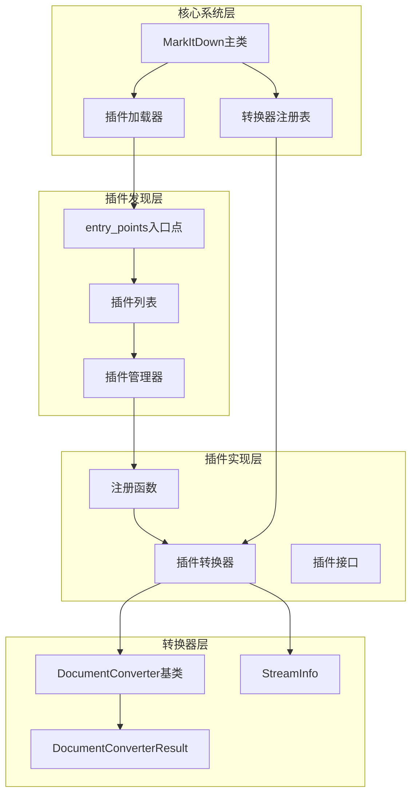
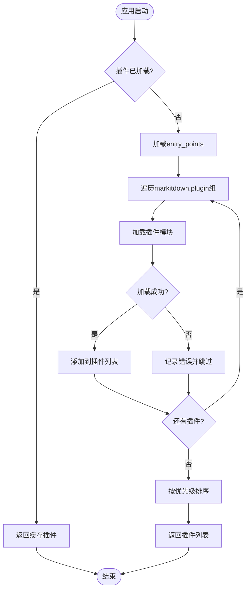
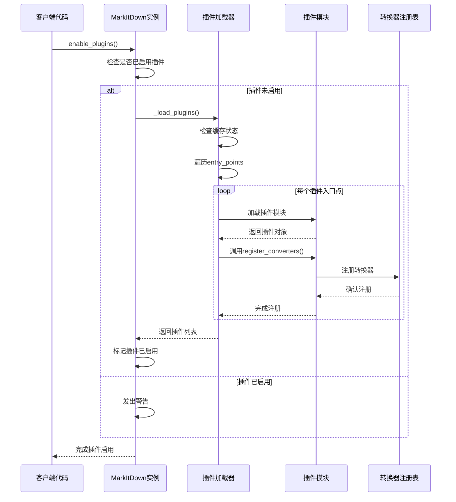
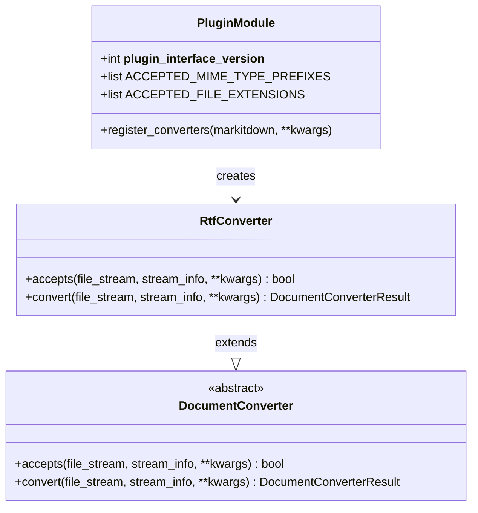
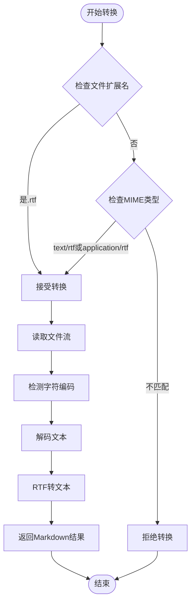
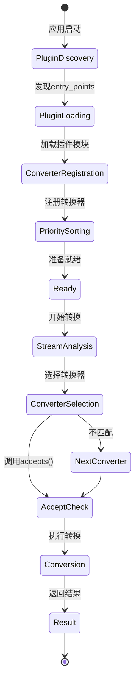
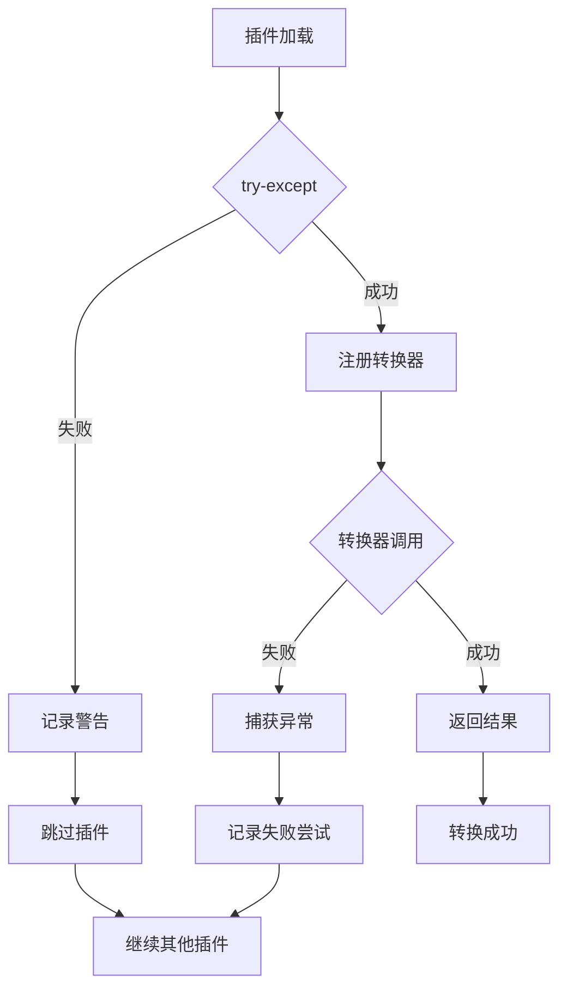
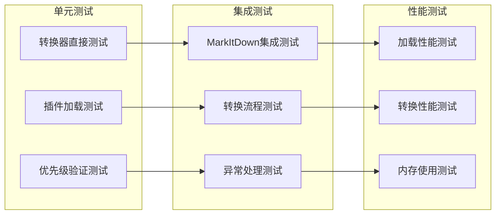

# MarkItDown 插件系统详细文档

<cite>
**本文档中引用的文件**
- [_markitdown.py](file://packages/markitdown/src/markitdown/_markitdown.py)
- [_base_converter.py](file://packages/markitdown/src/markitdown/_base_converter.py)
- [_plugin.py](file://packages/markitdown-sample-plugin/src/markitdown_sample_plugin/_plugin.py)
- [pyproject.toml](file://packages/markitdown-sample-plugin/pyproject.toml)
- [README.md](file://packages/markitdown-sample-plugin/README.md)
- [test_sample_plugin.py](file://packages/markitdown-sample-plugin/tests/test_sample_plugin.py)
- [__init__.py](file://packages/markitdown-sample-plugin/src/markitdown_sample_plugin/__init__.py)
- [__about__.py](file://packages/markitdown-sample-plugin/src/markitdown_sample_plugin/__about__.py)
- [__init__.py](file://packages/markitdown/src/markitdown/__init__.py)
</cite>

## 目录
1. [简介](#简介)
2. [插件系统架构](#插件系统架构)
3. [基于entry_points的插件发现机制](#基于entry_points的插件发现机制)
4. [MarkItDown类中的插件管理](#markitdown类中的插件管理)
5. [自定义插件开发指南](#自定义插件开发指南)
6. [RTF格式转换插件示例](#rtf格式转换插件示例)
7. [插件与核心转换器的交互](#插件与核心转换器的交互)
8. [插件异常处理与版本兼容性](#插件异常处理与版本兼容性)
9. [插件测试与发布](#插件测试与发布)
10. [最佳实践与故障排除](#最佳实践与故障排除)

## 简介

MarkItDown插件系统是一个基于Python标准库`importlib.metadata.entry_points`的可扩展架构，允许开发者为MarkItDown库添加自定义文档转换功能。该系统采用延迟加载机制，支持动态发现和注册插件，确保核心功能的轻量化同时提供强大的扩展能力。

插件系统的核心特性包括：
- 基于setuptools entry_points的自动发现机制
- 插件优先级管理系统
- 异常隔离和优雅降级
- 版本兼容性控制
- 灵活的转换器注册接口

## 插件系统架构

MarkItDown插件系统采用分层架构设计，包含以下核心组件：



**图表来源**
- [_markitdown.py](file://packages/markitdown/src/markitdown/_markitdown.py#L61-L104)
- [_base_converter.py](file://packages/markitdown/src/markitdown/_base_converter.py#L41-L105)

**章节来源**
- [_markitdown.py](file://packages/markitdown/src/markitdown/_markitdown.py#L1-L777)
- [_base_converter.py](file://packages/markitdown/src/markitdown/_base_converter.py#L1-L106)

## 基于entry_points的插件发现机制

### entry_points配置原理

MarkItDown使用Python标准库的`importlib.metadata.entry_points`来发现和加载插件。每个插件包需要在`pyproject.toml`中配置特定的entry_points组：



**图表来源**
- [_markitdown.py](file://packages/markitdown/src/markitdown/_markitdown.py#L61-L82)

### 插件发现流程详解

插件发现过程遵循以下步骤：

1. **延迟加载机制**：插件仅在首次调用时加载，避免不必要的资源消耗
2. **异常隔离**：单个插件加载失败不会影响其他插件的正常工作
3. **缓存策略**：加载后的插件会被缓存，后续调用直接返回缓存结果
4. **动态发现**：运行时扫描所有可用的entry_points

**章节来源**
- [_markitdown.py](file://packages/markitdown/src/markitdown/_markitdown.py#L61-L82)

## MarkItDown类中的插件管理

### enable_plugins方法实现逻辑

`enable_plugins`方法负责激活插件系统并注册插件提供的转换器：



**图表来源**
- [_markitdown.py](file://packages/markitdown/src/markitdown/_markitdown.py#L220-L256)

### 插件注册与优先级管理

插件注册过程涉及以下关键机制：

1. **转换器优先级系统**：插件可以指定转换器的执行优先级
2. **稳定排序保证**：相同优先级的转换器保持注册顺序
3. **动态优先级调整**：运行时可以根据需要调整转换器优先级

**章节来源**
- [_markitdown.py](file://packages/markitdown/src/markitdown/_markitdown.py#L220-L256)
- [_markitdown.py](file://packages/markitdown/src/markitdown/_markitdown.py#L633-L682)

## 自定义插件开发指南

### 项目结构搭建

开发自定义插件需要遵循标准的Python包结构：

```
my-markitdown-plugin/
├── src/
│   └── my_plugin/
│       ├── __init__.py
│       ├── _plugin.py
│       └── __about__.py
├── tests/
│   ├── __init__.py
│   └── test_my_plugin.py
├── pyproject.toml
└── README.md
```

### _plugin.py实现规范

插件模块必须实现以下核心元素：



**图表来源**
- [_plugin.py](file://packages/markitdown-sample-plugin/src/markitdown_sample_plugin/_plugin.py#L1-L72)

### register_converter装饰器使用

虽然MarkItDown没有显式的`register_converter`装饰器，但插件通过调用`MarkItDown.register_converter()`方法来注册转换器。每个转换器必须继承`DocumentConverter`基类并实现必要的方法。

**章节来源**
- [_plugin.py](file://packages/markitdown-sample-plugin/src/markitdown_sample_plugin/_plugin.py#L1-L72)
- [_base_converter.py](file://packages/markitdown/src/markitdown/_base_converter.py#L41-L105)

## RTF格式转换插件示例

### 插件实现细节

RTF转换插件展示了完整的插件开发模式：



**图表来源**
- [_plugin.py](file://packages/markitdown-sample-plugin/src/markitdown_sample_plugin/_plugin.py#L35-L71)

### 关键实现要素

1. **MIME类型识别**：支持多种RTF MIME类型的识别
2. **文件扩展名验证**：直接检查文件扩展名
3. **字符编码处理**：使用系统默认编码或指定编码
4. **转换器优先级**：默认使用特定文件格式优先级

**章节来源**
- [_plugin.py](file://packages/markitdown-sample-plugin/src/markitdown_sample_plugin/_plugin.py#L1-L72)

## 插件与核心转换器的交互

### 转换器生命周期管理

插件转换器与核心系统的交互遵循严格的生命周期：



**图表来源**
- [_markitdown.py](file://packages/markitdown/src/markitdown/_markitdown.py#L580-L620)

### StreamInfo数据传递

插件转换器通过`StreamInfo`对象接收文件元数据：

| 属性 | 类型 | 描述 | 用途 |
|------|------|------|------|
| mimetype | Optional[str] | 文件MIME类型 | 类型识别和格式判断 |
| extension | Optional[str] | 文件扩展名 | 后缀匹配和类型推断 |
| charset | Optional[str] | 字符编码 | 文本解码和处理 |
| filename | Optional[str] | 文件名 | 名称匹配和特殊处理 |
| url | Optional[str] | 来源URL | 网络内容识别 |

**章节来源**
- [_markitdown.py](file://packages/markitdown/src/markitdown/_markitdown.py#L580-L620)

## 插件异常处理与版本兼容性

### 异常处理机制

插件系统实现了多层次的异常处理：



**图表来源**
- [_markitdown.py](file://packages/markitdown/src/markitdown/_markitdown.py#L61-L82)
- [_markitdown.py](file://packages/markitdown/src/markitdown/_markitdown.py#L236-L250)

### 版本兼容性控制

插件接口版本通过`__plugin_interface_version__`变量进行控制：

```python
__plugin_interface_version__ = 1  # 当前支持的版本
```

这种设计确保：
- 向后兼容性：现有插件在新版本中仍能正常工作
- 渐进式升级：插件可以逐步迁移到新版本
- 错误检测：不兼容的插件会被安全地跳过

**章节来源**
- [_plugin.py](file://packages/markitdown-sample-plugin/src/markitdown_sample_plugin/_plugin.py#L12-L13)
- [_markitdown.py](file://packages/markitdown/src/markitdown/_markitdown.py#L61-L82)

## 插件测试与发布

### 测试框架设计

插件测试应覆盖以下关键场景：



**图表来源**
- [test_sample_plugin.py](file://packages/markitdown-sample-plugin/tests/test_sample_plugin.py#L1-L44)

### 发布配置要点

插件发布的`pyproject.toml`配置必须包含：

1. **entry_points声明**：正确配置`markitdown.plugin`组
2. **依赖关系**：明确声明对markitdown的版本要求
3. **元数据信息**：完整的项目描述和作者信息
4. **测试配置**：包含测试环境和覆盖率设置

**章节来源**
- [pyproject.toml](file://packages/markitdown-sample-plugin/pyproject.toml#L40-L45)
- [test_sample_plugin.py](file://packages/markitdown-sample-plugin/tests/test_sample_plugin.py#L1-L44)

## 最佳实践与故障排除

### 开发最佳实践

1. **优先级设置**：合理设置转换器优先级以避免冲突
2. **异常处理**：在转换器中妥善处理各种异常情况
3. **资源管理**：正确管理文件流和内存使用
4. **测试覆盖**：确保全面的单元测试和集成测试

### 常见问题排除

| 问题 | 可能原因 | 解决方案 |
|------|----------|----------|
| 插件无法加载 | entry_points配置错误 | 检查pyproject.toml中的配置 |
| 转换器不被调用 | accepts()方法返回False | 检查文件类型识别逻辑 |
| 转换失败 | 编码或格式问题 | 添加适当的异常处理 |
| 性能问题 | 大文件处理不当 | 实现流式处理和内存优化 |

### 调试技巧

1. **插件发现调试**：使用`markitdown --list-plugins`命令验证插件发现
2. **转换流程跟踪**：通过日志输出跟踪转换器选择过程
3. **性能监控**：监控插件加载和转换的性能指标
4. **兼容性测试**：在不同Python版本和markitdown版本上测试插件

**章节来源**
- [_markitdown.py](file://packages/markitdown/src/markitdown/_markitdown.py#L236-L250)
- [README.md](file://packages/markitdown-sample-plugin/README.md#L70-L111)