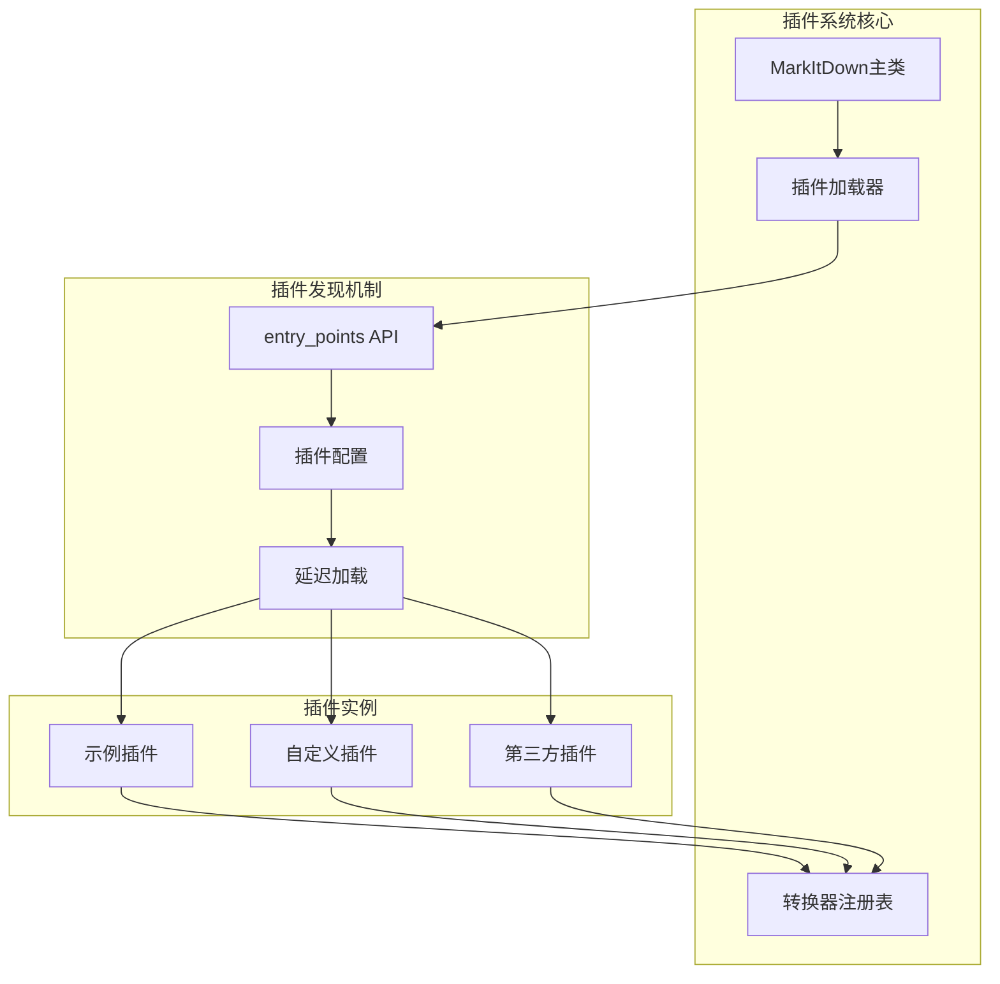
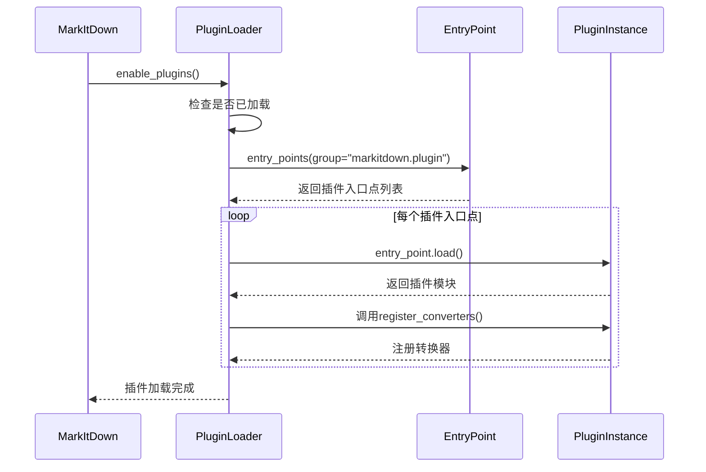
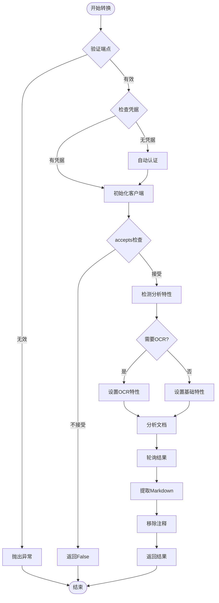
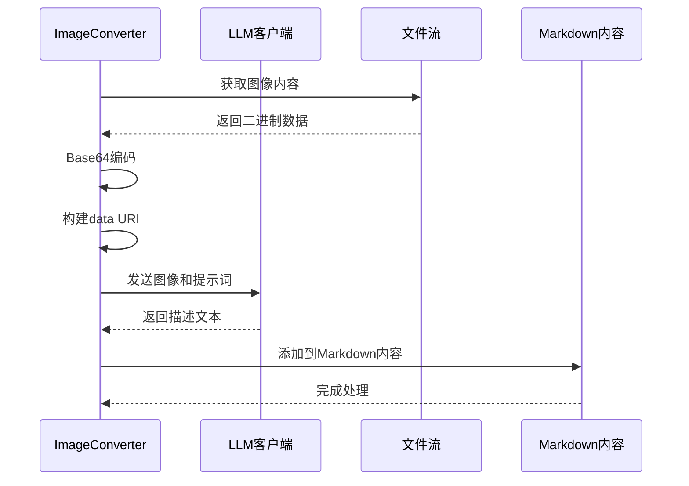
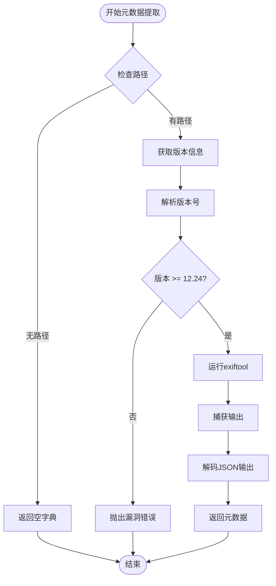
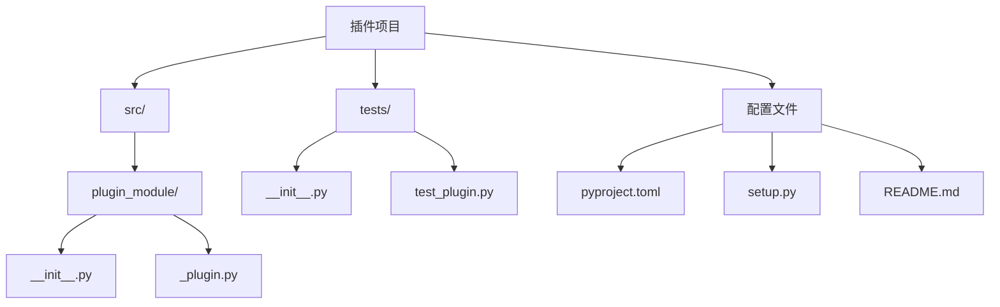
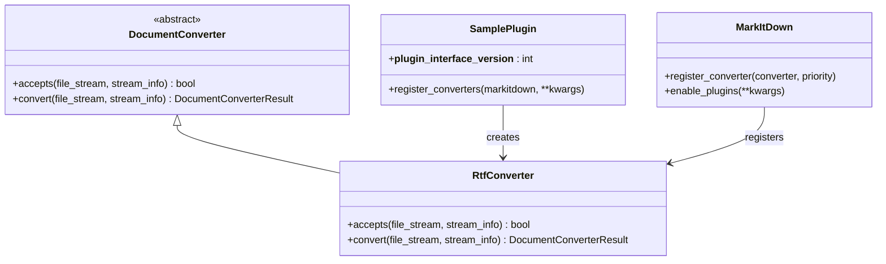

# 高级功能

<cite>
**本文档中引用的文件**
- [_markitdown.py](file://packages/markitdown/src/markitdown/_markitdown.py)
- [_base_converter.py](file://packages/markitdown/src/markitdown/_base_converter.py)
- [_doc_intel_converter.py](file://packages/markitdown/src/markitdown/converters/_doc_intel_converter.py)
- [_llm_caption.py](file://packages/markitdown/src/markitdown/converters/_llm_caption.py)
- [_exiftool.py](file://packages/markitdown/src/markitdown/converters/_exiftool.py)
- [_plugin.py](file://packages/markitdown-sample-plugin/src/markitdown_sample_plugin/_plugin.py)
- [pyproject.toml](file://packages/markitdown-sample-plugin/pyproject.toml)
- [__main__.py](file://packages/markitdown/src/markitdown/__main__.py)
- [test_sample_plugin.py](file://packages/markitdown-sample-plugin/tests/test_sample_plugin.py)
</cite>

## 目录
1. [简介](#简介)
2. [插件系统架构](#插件系统架构)
3. [Azure Document Intelligence集成](#azure-document-intelligence集成)
4. [LLM图像描述功能](#llm图像描述功能)
5. [EXIF元数据提取](#exif元数据提取)
6. [开发自定义插件](#开发自定义插件)
7. [最佳实践](#最佳实践)
8. [故障排除](#故障排除)

## 简介

markitdown提供了强大的高级功能，包括可扩展的插件系统、Azure Document Intelligence集成、LLM图像描述和EXIF元数据提取。这些功能使markitdown能够处理复杂的文档转换需求，并支持与现代AI服务的无缝集成。

## 插件系统架构

### 核心架构设计

markitdown的插件系统基于Python的entry_points机制构建，提供了灵活的第三方扩展能力。



**图表来源**
- [_markitdown.py](file://packages/markitdown/src/markitdown/_markitdown.py#L61-L74)
- [_plugin.py](file://packages/markitdown-sample-plugin/src/markitdown_sample_plugin/_plugin.py#L20-L30)

### 插件加载机制

插件系统采用延迟加载策略，确保只有在需要时才加载插件：



**图表来源**
- [_markitdown.py](file://packages/markitdown/src/markitdown/_markitdown.py#L61-L74)

### enable_plugins方法内部机制

`enable_plugins`方法负责激活插件系统并注册所有可用的转换器：

**节来源**
- [_markitdown.py](file://packages/markitdown/src/markitdown/_markitdown.py#L224-L240)

该方法的核心功能包括：
1. 调用 `_load_plugins()` 函数加载插件
2. 遍历所有插件实例
3. 调用每个插件的 `register_converters()` 方法
4. 处理插件加载过程中的异常情况

## Azure Document Intelligence集成

### 配置参数详解

Azure Document Intelligence集成提供了强大的文档分析能力，支持多种文件格式的智能解析。

| 参数名称 | 类型 | 必需 | 默认值 | 描述 |
|---------|------|------|--------|------|
| docintel_endpoint | str | 是 | - | Document Intelligence服务端点URL |
| docintel_credential | AzureKeyCredential/TokenCredential | 否 | None | 认证凭据，支持密钥或令牌认证 |
| docintel_file_types | List[DocumentIntelligenceFileType] | 否 | 全部支持类型 | 指定支持的文件类型 |
| docintel_api_version | str | 否 | "2024-07-31-preview" | API版本号 |

### DocumentIntelligenceConverter工作流程



**图表来源**
- [_doc_intel_converter.py](file://packages/markitdown/src/markitdown/converters/_doc_intel_converter.py#L130-L254)

### 支持的文件类型

DocumentIntelligenceConverter支持以下文件类型：

| 文件类型 | MIME类型前缀 | 扩展名 | OCR支持 |
|---------|-------------|--------|---------|
| DOCX | application/vnd.openxmlformats-officedocument.wordprocessingml.document | .docx | 否 |
| PPTX | application/vnd.openxmlformats-officedocument.presentationml | .pptx | 否 |
| XLSX | application/vnd.openxmlformats-officedocument.spreadsheetml.sheet | .xlsx | 否 |
| HTML | text/html, application/xhtml+xml | .html | 否 |
| PDF | application/pdf, application/x-pdf | .pdf | 是 |
| JPEG | image/jpeg | .jpg, .jpeg | 是 |
| PNG | image/png | .png | 是 |
| BMP | image/bmp | .bmp | 是 |
| TIFF | image/tiff | .tiff | 是 |

**节来源**
- [_doc_intel_converter.py](file://packages/markitdown/src/markitdown/converters/_doc_intel_converter.py#L60-L120)

## LLM图像描述功能

### 集成参数配置

LLM图像描述功能允许使用大语言模型为图像生成详细的描述文本：

| 参数名称 | 类型 | 必需 | 默认值 | 描述 |
|---------|------|------|--------|------|
| llm_client | Any | 是 | - | LLM客户端实例（如OpenAI客户端） |
| llm_model | str | 是 | - | 使用的LLM模型名称 |
| llm_prompt | str | 否 | "Write a detailed caption for this image." | 自定义提示词 |

### 图像描述处理流程



**图表来源**
- [_llm_caption.py](file://packages/markitdown/src/markitdown/converters/_llm_caption.py#L10-L50)
- [_image_converter.py](file://packages/markitdown/src/markitdown/converters/_image_converter.py#L82-L137)

### 实现细节

LLM图像描述功能的实现包含以下关键步骤：

1. **内容类型检测**：从StreamInfo中获取MIME类型，或根据扩展名推断
2. **Base64编码**：将图像数据转换为Base64格式
3. **Data URI构建**：创建符合OpenAI API要求的Data URI格式
4. **提示词处理**：支持自定义提示词，默认使用详细描述模板
5. **API调用**：通过聊天完成接口生成图像描述

**节来源**
- [_llm_caption.py](file://packages/markitdown/src/markitdown/converters/_llm_caption.py#L1-L51)

## EXIF元数据提取

### 版本安全检查

EXIF工具集成包含了严格的安全检查机制，确保使用的版本不受CVE-2021-22204漏洞影响：



**图表来源**
- [_exiftool.py](file://packages/markitdown/src/markitdown/converters/_exiftool.py#L15-L52)

### 支持的元数据字段

EXIF元数据提取支持以下常见字段：

| 字段名称 | 描述 |
|---------|------|
| ImageSize | 图像尺寸信息 |
| Title | 图像标题 |
| Caption | 图像说明 |
| Description | 详细描述 |
| Keywords | 关键词标签 |
| Artist | 艺术家信息 |
| Author | 作者信息 |
| DateTimeOriginal | 原始拍摄时间 |
| CreateDate | 创建日期 |
| GPSPosition | GPS位置信息 |

**节来源**
- [_exiftool.py](file://packages/markitdown/src/markitdown/converters/_exiftool.py#L1-L53)

### 路径查找策略

markitdown实现了智能的exiftool路径查找策略：

1. **用户指定路径**：优先使用传入的`exiftool_path`参数
2. **环境变量**：检查`EXIFTOOL_PATH`环境变量
3. **系统路径**：在常见安装目录中搜索`exiftool`可执行文件

支持的搜索路径包括：
- Unix系统：`/usr/bin`, `/usr/local/bin`, `/opt`, `/opt/bin`, `/opt/local/bin`, `/opt/homebrew/bin`
- Windows系统：`C:\Windows\System32`, `C:\Program Files`, `C:\Program Files (x86)`

## 开发自定义插件

### 插件开发步骤

开发自定义markitdown插件需要遵循标准的插件接口规范：

#### 步骤1：项目结构设置



#### 步骤2：插件接口实现

插件必须实现以下核心组件：

1. **插件版本声明**：`__plugin_interface_version__ = 1`
2. **转换器类**：继承`DocumentConverter`基类
3. **注册函数**：`register_converters(markitdown: MarkItDown, **kwargs)`
4. **accepts方法**：判断是否接受特定文件类型
5. **convert方法**：执行实际的转换逻辑

#### 步骤3：entry_points配置

在`pyproject.toml`中正确配置entry_points：

```toml
[project.entry-points."markitdown.plugin"]
sample_plugin = "markitdown_sample_plugin"
```

**节来源**
- [pyproject.toml](file://packages/markitdown-sample-plugin/pyproject.toml#L42-L44)
- [_plugin.py](file://packages/markitdown-sample-plugin/src/markitdown_sample_plugin/_plugin.py#L20-L30)

### 示例插件分析

以markitdown-sample-plugin为例，展示完整的插件实现：



**图表来源**
- [_plugin.py](file://packages/markitdown-sample-plugin/src/markitdown_sample_plugin/_plugin.py#L25-L71)

### 插件测试框架

插件应包含完整的测试套件：

**节来源**
- [test_sample_plugin.py](file://packages/markitdown-sample-plugin/tests/test_sample_plugin.py#L1-L44)

测试内容包括：
1. **直接转换器测试**：独立测试RtfConverter的功能
2. **MarkItDown集成测试**：测试插件与MarkItDown的集成
3. **边界条件测试**：测试各种文件格式和边缘情况

## 最佳实践

### 插件开发最佳实践

1. **错误处理**：实现完善的异常处理机制
2. **性能优化**：避免不必要的文件读取操作
3. **资源管理**：正确处理文件流位置重置
4. **兼容性**：确保向后兼容性和版本控制
5. **文档化**：提供清晰的API文档和使用示例

### 配置管理最佳实践

1. **环境变量支持**：支持通过环境变量配置关键参数
2. **默认值设置**：为所有配置参数提供合理的默认值
3. **验证机制**：在初始化时验证配置的有效性
4. **日志记录**：添加适当的日志记录以便调试

### 性能优化建议

1. **延迟加载**：利用插件系统的延迟加载特性
2. **缓存策略**：对重复的转换操作实施缓存
3. **流式处理**：尽可能使用流式处理减少内存占用
4. **并发控制**：合理控制并发转换的数量

## 故障排除

### 常见问题及解决方案

#### 插件加载失败

**问题症状**：插件无法被识别或加载时出现错误

**解决方案**：
1. 检查entry_points配置是否正确
2. 验证插件包是否正确安装
3. 确认插件接口版本兼容性
4. 查看详细的错误堆栈信息

#### Azure Document Intelligence连接问题

**问题症状**：无法连接到Azure Document Intelligence服务

**解决方案**：
1. 验证endpoint URL的正确性
2. 检查网络连接和防火墙设置
3. 确认认证凭据的有效性
4. 检查API版本兼容性

#### LLM客户端配置问题

**问题症状**：图像描述功能无法正常工作

**解决方案**：
1. 验证LLM客户端实例的正确性
2. 检查模型名称的拼写和可用性
3. 确认API密钥或访问令牌的有效性
4. 测试网络连接和API限制

#### EXIF工具版本问题

**问题症状**：EXIF元数据提取失败或报告安全警告

**解决方案**：
1. 升级exiftool到12.24或更高版本
2. 检查exiftool的安装路径
3. 验证可执行文件的权限设置
4. 使用环境变量指定正确的路径

### 调试技巧

1. **启用详细日志**：通过环境变量或配置启用详细日志记录
2. **分步测试**：分别测试插件的各个组件
3. **单元测试**：编写全面的单元测试覆盖各种场景
4. **集成测试**：在完整环境中验证插件功能

**节来源**
- [_markitdown.py](file://packages/markitdown/src/markitdown/_markitdown.py#L61-L74)
- [_doc_intel_converter.py](file://packages/markitdown/src/markitdown/converters/_doc_intel_converter.py#L130-L150)